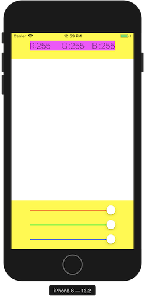
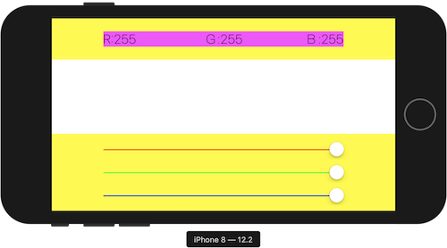
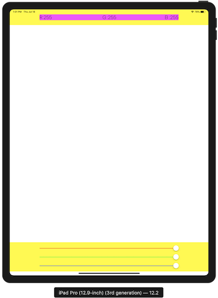
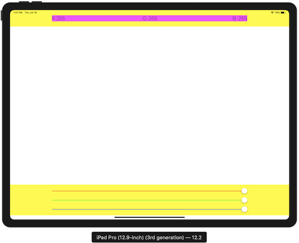
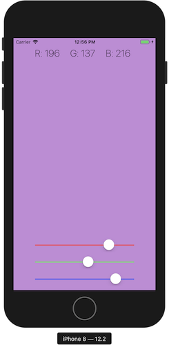

# 2019.07.19
### 第五節 重複做事情的好幫手：迴圈
* for loop
    ```swift
    // 格式
    for 自己設定的名字 in 陣列的名字{
        // 要執行的程式碼
    }
    let array:[Int] = [1,2,3,4,5]
    for i in array{
        print(i)
    }
    // output: "1\n2\n3\n4\n5\n"

    var array2:[Int] = []
    for i in array{
        array2.append(i+2)
    }
    // array2: [3, 4, 5, 6, 7]

    let strArr:[String] = ["Acs","CcC","ewf","cAc"]
    var strArr2:[String] = []
    for str in strArr{
        strArr2.append(str.lowercased())
    }
    // output: ["acs", "ccc", "ewf", "cac"]

    // 全閉範圍區間 1...5 指的是 (1,2,3,4,5)
    // 半壁範圍區間 1..<5 指的是 (1,2,3,4)
    for index in 1...100{
        print(index)
    }
    // 從1印到100

    // 若for 中用不到index 可將index改為_
    for _ in 1...3{
        print("HI")
    }
    // 迴圈做3次

    // 九九乘法表
    for num1 in 1..<10{
        for num2 in 1..<10{
            print("\(num1) * \(num2) = \(num1*num2)")
        }
    }

    for index in 1...10 where index%2 == 1{
        print(index)
    }
    // output: "1\n3\n5\n7\n9\n"

    // for + dictionary
    let e2c:[String:String] = ["one":"一","two":"二","three":"三"]
    for (key,value) in e2c{
        print("\(key):\(value)")
    }
    // output: "three:三\ntwo:二\none:一\n"
    ```
* tuple 元組，把很多資料用小括號包起來
    ```swift
    // (key,value) : 稱為元組(tuple)，把很多資料用小括號包起來

    let colors = ("red","orange","yellow","green")
    // 元組用 colors.0 的方式存取

    // tuple 中可存不同型別
    let tuple = ("a",12,true,3.14,[1,2,3])
    let e2c = (one:"一",two:"二",three:"三")
    e2c.one // output: "一"
    e2c.0   // output: "一"
    ```
* while loop
    ```swift
    var index = 1
    while index <= 10 {
        print(index)
        index += 1
    }

    // while + array
    let array:[Int] = [1,2,3,4,5]
    var index = 0
    while index < array.count{
        print(array[index])
        index += 1
    }

    // repeat-while
    repeat{
        print("just do it \(index) times.")
        index += 1
    }while index < 11
    // 從1印到10
    // repeat-while 即使條件不符合，最少會執行一次，類似其他的do-while
    ```
---
### 第六節 函式：呼叫我！使命必達！
* DRY:Don't Repeat Youself : 避免使用重複程式碼
* function
    ```swift
    // 定義函式 : 函式還不會執行
    func functionName(parameter){
        // 會需要重複做的事情
    }
    // 呼叫函式 ： 函式執行
    functionName(parameter)

    func eat(foodName:String){
        print("eat "+foodName)
    }
    eat(foodName: "hamburger")
    // output: eat hamburger
    eat(foodName: "pizza")
    // output: eat pizza

    // 有回傳值的函式
    func add(num1:Int,num2:Int) -> Int{
        return num1 + num2
    }
    let ans = add(num1: 2, num2: 6)

    // 沒有回傳值的寫法
    func functionName(parameter){
    }
    func functionName(parameter) -> Void{
    }
    func functionName(parameter) -> (){
    }

    // 外部參數名： withWidth、andHeight
    // 內部參數名： width、height
    func calculateArea(withWidth width:Float, andHeight height:Float) -> Float{
        return width * height
    }
    calculateArea(withWidth: 12.3, andHeight: 45.6)

    // 省略外部參數名
    func buy(_ thing:String){
        print("buy "+thing)
    }
    buy("macbook")
    ```
* 變數可視範圍
    * 大括號裡面看得到外面
        ```swift
        var a:Int = 10
        if true{
            print(a)
        }
        // output: 10
        ```
    * 大括號外面看不到裡面
        ```swift

        if true{
            let i = 12
        }
        print(i)
        // output: 5
        ```
    * 大括號創造了新的命名空間
        ```swift
        let i = 5
        if true{
            let i = 12
        }
        print(i)
        // output: 5
        ```
---
### 第七節 閉包：請先想成這是沒有名字的函式
* closure(閉包)
* 沒有外部參數名
    ```swift
    let helloClosure = {
        print("hello")
    }
    helloClosure()

    let add = {
        (num1:Int,num2:Int) -> Int in
        return num1 + num2
    }
    add(3,5)
    // closure也有型別
    // helloClosure 的型別是()->()
    // add 的型別是(Int,Int)->Int
    ```
* 可當作變數傳入函式
    ```swift
    func calculate(num1:Int,num2:Int,operation:(Int,Int)->Int){
        print(operation(num1,num2))
    }
    let add = {
        (num1:Int,num2:Int) -> Int in
        return num1 + num2
    }
    calculate(num1: 3, num2: 4, operation: add)
    ```
* 簡寫closure
    1. 已經能夠確認參數與回傳值得型別的話，可以刪除，可以刪除Closure裡面參數跟回傳值得型別
        ```swift
        // before
        let add = {
        (num1:Int,num2:Int) -> Int in
        return num1 + num2
        }
        // after
        let add:(Int,Int)->Int = {
            (num1,num2) in
            return num1 + num2
        }
        ```
    2. 程式碼只有一行的情況下可以刪除``return``
        ```swift
        // before
        let add:(Int,Int)->Int = {
            (num1,num2) in
            return num1 + num2
        }
        // after
        let add:(Int,Int)->Int = {
            (num1,num2) in num1 + num2
        }
        ```
    3. 用``$0``,``$1``,``$2``...代替傳進來的參數名稱
        ```swift
        // before
        let add:(Int,Int)->Int = {
            (num1,num2) in num1 + num2
        }
        // after
        let add:(Int,Int)->Int = { $0 + $1 }
        ```
    4. 如果是最後或是唯一個參數，可把closure放在參數小括號外
        ```swift
        // before
        let numberArrayAddTen = numberArray.map({ $0+10 })
        // after
        let numberArrayAddTen = numberArray.map(){ $0+10 }
        ```
    5. 如果是唯一個參數，可省略參數小括號
        ```swift
        // before
        let numberArrayAddTen = numberArray.map(){ $0+10 }
        // after
        let numberArrayAddTen = numberArray.map{ $0+10 }
        ```
* 陣列的 map() 方法：把陣列的每個成員拿出來做一些事情
    ```swift
    var numberArray=[1,3,5,7,9,2,4,6,8,10]
    let numberArrayAddTen = numberArray.map {$0 + 10}
    }
    // output: [11,13,15,17,19,12,14,16,18,20]
    ```
* 陣列的 filter() 方法：過濾功能
    ```swift
    var numberArray=[1,3,5,7,9,2,4,6,8,10]
    let numberArrayEven = numberArray.filter {$0 % 2 == 0}
    // output: [2, 4, 6, 8, 10]
    ```
---
### 第八節 optional 與質數判斷APP
* optional型別 (非必需的)
    ```swift
    var i:Int = 10
    // i的型別是Int，儲存10
    var j:Int = nil
    // error: j的型別是Int，無法儲存nil
    var k:Int? = nil
    // 為了儲存nil和Int，必須使用optional Int型別(Int?)
    var isLightOn:Bool? = nil; 
    // 為了儲存nil和Bool，必須使用optional Bool型別(Int?)

    var x:Int?
    // x預設為nil

    var y:Int? = 8;
    print(y)
    // output: optional(8)

    y+2
    // error: optional Int 和 Int無法相加

    var z:Int!;
    // 除了用Int?表示optional外，也可用Int!表示
    // 用Int!在程式中，都不會檢查值是否為nil，類似其他語言
    ```
* 處理optional的方法
    1. 強迫解開包裝 force unwarpping 
        ```swift
        // 在變數後加上!可以強迫解開包裝
        var x:Int? = 8
        x! + 2
        // output: 10

        var y:Int? = nil
        y! + 2
        // error
        ```
    2. 先判斷是否有值，再做後續的處理
        ```swift
        var x:Int? = 8;
        if x != nil{
            x! + 2
            // output: 10
            x = x! + 2
            // x: optional(10)
        }
        ```
    3. optional binding:最好的處理方式
        ```swift
        var x:Int? = 8;
        if let myNumber = x{
            myNumber + 2
        }

        ```
* TernaryConditionl operator(三元運算子)
    ```swift
    var x:Int? = 3
    var y:Int
    y = x != nil ? x! : 0
    //等價於下面
    if x != nil{
        y = x!
    } else {
        y = 0
    }
    ```
* Nil-Coalesing operator(空值聚合運算子)
    ```swift
    var x:Int? = 3
    var y:Int
    y = x ?? 0
    //等價於下面
    if x != nil{
        y = x!
    } else {
        y = 0
    }
    ```
* 質數判斷APP
* playground練習
    ```swift
    let inputNumber:Int = 18
    var isPrime:Bool? = true

    if inputNumber <= 0 {
        isPrime = nil
    } else if inputNumber == 1{
        isPrime = true
    } else {
        for i in 2..<inputNumber{
            if(inputNumber % i == 0) {
                isPrime = false
            }
        }
    }

    if isPrime == true {
        print("\(inputNumber) is prime")
    } else if isPrime == false{
        print("\(inputNumber) isn't prime")
    } else {
        print("reenter")
    }

    // 函數寫法
    func checkPrime(withNumber testNumber:Int) -> String{
        var isPrime:Bool? = true
        
        if testNumber <= 0 {
            isPrime = nil
        } else if testNumber == 1{
            isPrime = true
        } else {
            for i in 2..<testNumber{
                if(testNumber % i == 0) {
                    isPrime = false
                }
            }
        }
        
        
        if isPrime == true {
            return "\(testNumber) is prime"
        } else if isPrime == false{
            return "\(testNumber) isn't prime"
        } else {
            return "reenter"
        }
    }
    print(checkPrime(withNumber: inputNumber))
    ```
* ``@IBaction`` interface builder Action
* push the keyboard on :``inputTextField.becomeFirstResponder()``
* viewController.swift
    ```swift
    import UIKit

    class ViewController: UIViewController {
        
        @IBOutlet weak var inputTextField: UITextField!
        
        @IBOutlet weak var resultLabel: UILabel!
        
        override var preferredStatusBarStyle: UIStatusBarStyle{
            return .lightContent
        }
        
        @IBAction func doThePrimeTest(_ sender: UIButton) {
            // 1.把文字輸入框的文字拿出
            if let inputText = inputTextField.text, let inputNumber = Int(inputText){
                // 3.用checkPrime()得到輸出的字串
                // 4.用resultLabel顯示結果
                checkPrime(withNumber: inputNumber){
                    self.resultLabel.text = $0
                    self.resultLabel.isHidden = false
                }
            }
            inputTextField.text = ""
        }
        
        
        override func viewDidLoad() {
            super.viewDidLoad()
            // Do any additional setup after loading the view.
            // push the keyboard on
            inputTextField.becomeFirstResponder()
        }
        
        func checkPrime(withNumber testNumber:Int) -> String{
            var isPrime:Bool? = true
            
            if testNumber <= 0 {
                isPrime = nil
            } else if testNumber == 1{
                isPrime = true
            } else {
                for i in 2..<testNumber{
                    if(testNumber % i == 0) {
                        isPrime = false
                        break
                    }
                }
            }
            
            
            if isPrime == true {
                return "\(testNumber) is prime"
            } else if isPrime == false{
                return "\(testNumber) isn't prime"
            } else {
                return "reenter"
            }
        }
        
        
        func checkPrime(withNumber number:Int,andCompletionHandler handler: (String)->()){
            handler(checkPrime(withNumber: number))
        }
        
    }

    ```
* 作品截圖

---
### 第九節 物件導向程式設計(上)
* OOP : object-oriented programming
    ```swift
    // Lego類別，可想成是製造物件的藍圖
    // 類別名稱第1個字通常用大寫
    class Lego{
        // 物件有的屬性(property)，描述物件的特性
        var color = "blue"
        var size = 8;

        // 物件的方法，描述物件會做的事
        func connect() {
            print("connect with another block")
        }
        func remove() {
            print("disconnect with another block")
        }
    }

    let oneBlock = Lego()
    // Lego() : 建立樂高物件

    oneBlock.color
    oneBlock.size
    // 存取oneBlock這塊樂高的屬性

    class Baby {
        var name:String = "Tom"
        var age:Int = 1
        
        func sleep(){
            print("sleep")
        }
        
        func introduceSelf(){
            print("My name is \(name)")
        }
    }

    let baby1 = Baby()
    let baby2 = Baby()
    baby2.name = "Nancy"

    baby1.introduceSelf()
    // output: My name is Tom
    baby2.introduceSelf()
    // output: My name is Nancy

    // 每個不同的物件是相互獨立的
    ```
* 初始化
    ```swift
        class Baby {
        var name:String
        var age:Int
        
        init(){
            // 要先初始化屬性，才能呼叫方法
            name = "Tom"
            age = 1
            introduceSelf()
        }
        init(name:String){
            self.name = name
            age = 2;
            introduceSelf()
        }
        init(age:Int){
            name = "Sophie"
            self.age = age
            introduceSelf()
        }
        init(name:String, age:Int) {
            self.name = name
            self.age = age
            introduceSelf()
        }
        
        func sleep(){
            print("sleep")
        }
        func introduceSelf(){
            print("My name is \(name).I am \(age) years old")
        }
    }

    let baby1 = Baby()
    let baby2 = Baby(name: "Ian")
    let baby3 = Baby(age: 3)
    let baby4 = Baby(name: "Eric", age: 2)
    // output:
    // My name is Tom.I am 1 years old
    // My name is Ian.I am 2 years old
    // My name is Sophie.I am 3 years old
    // My name is Eric.I am 2 years old
    ```
* 子類別 Subclass : 繼承別的類別的屬性與方法
    ```swift
    class Baby {
        var name:String
        var age:Int
        
        init(){
            // 要先初始化屬性，才能呼叫方法
            name = "Tom"
            age = 1
            introduceSelf()
        }
        init(name:String){
            self.name = name
            age = 2;
            introduceSelf()
        }
        init(age:Int){
            name = "Sophie"
            self.age = age
            introduceSelf()
        }
        init(name:String, age:Int) {
            self.name = name
            self.age = age
            introduceSelf()
        }
        
        func sleep(){
            print("sleep")
        }
        func introduceSelf(){
            print("My name is \(name).I am \(age) years old")
        }
    }
    // CuteBaby 繼承 Baby
    class CuteBaby:Baby{
        var nickname:String
        func danceAndSing(){
            print("Dance and sing.")
        }
        // 覆寫 Baby 的 sleep() 
        override func sleep() {
            print("sleep with cute smile")
            super.sleep()
        }
        // 覆寫 Baby 的 introduceSelf()
        override func introduceSelf() {
            print("My name ia \(nickname)")
        }
        // 覆寫 init() 順序
        // 1. 初始化子類別屬性
        // 2. super.init()
        // 3. 設定父類別屬性
        override init() {
            nickname = "QQ"
            super.init()
            name = "Sunny"
        }
    }

    let iAmSoQ = CuteBaby()
    iAmSoQ.name
    iAmSoQ.nickname
    iAmSoQ.sleep()
    // output: 
    // My name ia QQ
    // sleep with cute smile
    // sleep
    ```
---
### 第十節 UIView 與記憶體管理
* ``deinit()``釋放記憶體
    ```swift
    class Person{
        var firstName = "Ian"
        var lastName = "Lu"
        var fullName:String
        init() {
            fullName = firstName+lastName;
            print("A person is being initialized")
        }
        deinit {
            print("A person is being deinitialized")
        }
    }
    var person1:Person? = Person();
    // 小括號的完整意義
    // 1. 啟動一塊記憶體
    // 2. 然後執行init()方法

    person1?.fullName

    // 當person實體不在被人需要會執行deinit()方法，回收記憶體
    // person1 = nil

    // person1 和 person2 參考同一段記憶體
    var person2:Person? = person1
    person1?.firstName = "Wei"
    // person1?.firstName : "Wei"
    // person2?.firstName : "Wei"

    var number1 = 1
    var number2 = number1
    number1 = 10
    // number1 : 10
    // number2 : 1

    person2 = nil
    // 現在還有person1 參考這段記憶體，所以不會執行deinit()方法
    person1 = nil
    // 當person1不在參考這段記憶體，就沒有其他變數會參考這段記憶體了，所以此時會執行deinit()方法，回收記憶體
    ```
* retain cycle 循環參考
    ```swift
    class Person{
        var heart:Heart?
        init() {
            print("A person is being initialized")
        }
        deinit {
            print("A person is being deinitialized")
        }
    }
    class Heart{
        var person:Person?
        init() {
            print("A heart is being initialized")
        }
        deinit {
            print("A heart is being deinitialized")
        }
    }

    var aPerson:Person? = Person()
    var aHeart:Heart? = Heart()
    //-------------
    aPerson = nil
    aHeart = nil
    //output:
    //A person is being initialized
    //A heart is being initialized
    //A person is being deinitialized
    //A heart is being deinitialized
    //-------------

    //------------retain cycle
    aPerson?.heart = aHeart
    aHeart?.person = aPerson

    aPerson = nil
    // 由於aHeart.person仍在使用所以不會釋放
    aHeart = nil
    // output:
    //A person is being initialized
    //A heart is being initialized
    //-------------
    ```
* 解決方法：weak弱參考
    ```swift
    class Person{
        weak var heart:Heart?
        init() {
            print("A person is being initialized")
        }
        deinit {
            print("A person is being deinitialized")
        }
    }
    class Heart{
        weak var person:Person?
        init() {
            print("A heart is being initialized")
        }
        deinit {
            print("A heart is being deinitialized")
        }
    }

    var aPerson:Person? = Person()
    var aHeart:Heart? = Heart()

    aPerson?.heart = aHeart
    aHeart?.person = aPerson

    aPerson = nil
    aHeart = nil
    // output:
    //A person is being initialized
    //A heart is being initialized
    //A person is being deinitialized
    //A heart is being deinitialized
    ```
* UIView
    * 屬性與方法
        * ``backgroundColor``
        * ``alpha``
        * ``isHidden``
        * ``addSubView()``
    * 範例
        ```swift
        class ViewController: UIViewController {

            @IBOutlet weak var midRect: UIView!
            override func viewDidLoad() {
                super.viewDidLoad()
                // Do any additional setup after loading the view.
                // 調整背景色
                midRect.backgroundColor = UIColor.green
                // 調整透明度
                midRect.alpha = 0.5
                // 隱藏midRect
                // midRect.isHidden = true
                
                
                // optional chaining
                // view.viewWithTag(101)?.backgroundColor = UIColor.lightGray
                
                // 自己加入UIView
                let viewArea = CGRect(x: 50, y: 400, width: 100, height: 50)
                let smallRect = UIView(frame: viewArea)
                smallRect.backgroundColor = UIColor.purple
                // 將自己做的UIView加入self.view的subView
                // view.addSubview(smallRect)
                // 不一定要加入self.view的subView，也可以加入其他UIView的subView，如下
                view.viewWithTag(101)?.addSubview(smallRect)
            }
        }
        ```
---
### 第十一節 認識基礎UI元件與自動排版
* UISwitch
    ```swift
    class ViewController: UIViewController {
        @IBOutlet weak var mySwitch: UISwitch!
        
        @IBAction func makeAChange(_ sender: UISwitch) {
            if sender.isOn==true{
                print("isON")
                view.backgroundColor = .white
            } else {
                print("isOFF")
                view.backgroundColor = .black
            }
        }
        
        @objc func codeSwitchChanged(_ sender: UISwitch) {
            if sender.isOn==true{
                print("isON")
                view.backgroundColor = .white
            } else {
                print("isOFF")
                view.backgroundColor = .black
            }
            
        }
        override func viewDidLoad() {
            super.viewDidLoad()
            mySwitch.isOn = false
            makeAChange(mySwitch)
            
            // generate a UISwitch using code
            let callSwitch = UISwitch(frame: CGRect(x: view.frame.midX-51/2, y: view.frame.maxY-100, width: 51, height: 31))
            view.addSubview(callSwitch)
            
            callSwitch.isOn = true;
            callSwitch.addTarget(self, action: #selector(ViewController.codeSwitchChanged(_:)), for: .valueChanged)
        }
    }
    ```
* UISegmentedControl
    ```swift
    class ViewController: UIViewController {
        @IBAction func colorToggleChanged(_ sender: UISegmentedControl) {
            if sender.selectedSegmentIndex == 0{
                view.backgroundColor = .white
            } else if sender.selectedSegmentIndex == 1{
                view.backgroundColor = .black
            } else if sender.selectedSegmentIndex == 2{
                view.backgroundColor = .red
            } else if sender.selectedSegmentIndex == 3{
                view.backgroundColor = .orange
            } else if sender.selectedSegmentIndex == 4{
                view.backgroundColor = .yellow
            } else {
                
            }
            
        }
        
        @IBAction func myToggleChanged(_ sender: UISegmentedControl) {
            
            if sender.selectedSegmentIndex == 0{
                print("public")
            } else if sender.selectedSegmentIndex == 1{
                print("private")
            }
        }
        override func viewDidLoad() {
            super.viewDidLoad()
            // Do any additional setup after loading the view.
        }
    }

    ```
* UISlider
    ```swift
    class ViewController: UIViewController {

        @IBOutlet weak var myLabel: UILabel!
        
        @IBAction func sliderChanged(_ sender: UISlider) {
            myLabel.text = "\(Int(sender.value))"
        }
        
        override func viewDidLoad() {
            super.viewDidLoad()
            // Do any additional setup after loading the view.
        }
    }
    ```
* auto layout 自動排版
    * 因iPhone各版本大小不同如果用iPhone開發，用iPad開啟，就會發生跑版
    * auto layout要設定以下屬性x,y,width,height
    * 以UIswiych置中為例，要點選元件後按右下角align，選擇Horizontally in Container 和 Vertically in Container 在選取 Add Containers，這樣就完成 x,y 的調整，接下來點選右下角的Add New Constraints設定width,height，就完成了
    * 依照比例設定方法：
        1. 先設定等寬
        2. 再設定比例
* APP:color finder
    * ViewController.swift
    ```swift
    class ViewController: UIViewController {
        var redValue = 255
        var greenValue = 255
        var blueValue = 255
        @IBOutlet weak var redText: UILabel!
        @IBOutlet weak var greenText: UILabel!
        @IBOutlet weak var blueText: UILabel!
        
        @IBAction func redSliderChanged(_ sender: UISlider) {
            redValue = Int(sender.value)
            redText.text = "R: \(redValue)"
            changeBackgroundColor()
        }
        
        @IBAction func greenSliderChanged(_ sender: UISlider) {
            greenValue = Int(sender.value)
            greenText.text = "G: \(greenValue)"
            changeBackgroundColor()
        }
        @IBAction func blueSliderChanged(_ sender: UISlider) {
            blueValue = Int(sender.value)
            blueText.text = "B: \(blueValue)"
            changeBackgroundColor()
        }
        
        func changeBackgroundColor() {
            view.backgroundColor = UIColor(red: CGFloat(redValue)/255, green: CGFloat(greenValue)/255, blue: CGFloat(blueValue)/255, alpha: 1)
        }
        
        override func viewDidLoad() {
            super.viewDidLoad()
            // Do any additional setup after loading the view.
        }
    }
    ```
    * layout
        * 透過黃色UIView和紫色UIView協助label和slider的定位，再搭配auto layout設定x,y,width,height使得在各個畫面都能呈現想要的版型
    
    
    
    

* 作品截圖

    