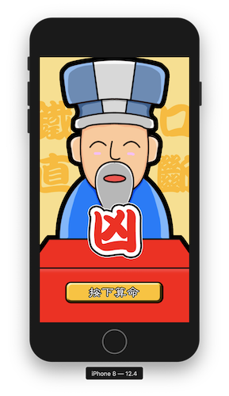

# 2019.08.02
### 第十二節 更多UI元件介紹
* UIAlertController
    * title
    * message
    * UIAlertAction
    * code
        ```swift
        @IBAction func showAlert(_ sender: UIButton) {
            let myAlert = UIAlertController(title: "Hello", message: "How are you", preferredStyle: .alert)
            
            let okAction = UIAlertAction(title: "OK", style: .default) {
                (action:UIAlertAction) in
                // 關閉畫面
                self.dismiss(animated: true, completion: nil)
            }
            // 如果只要self.dismiss()可以簡寫如下
            // let okAction = UIAlertAction(title: "OK", style: .default)
            
            let helloAction = UIAlertAction(title: "Say Hello", style: .destructive) {
                (action:UIAlertAction) in
                print("Hello")
                self.dismiss(animated: true, completion: nil)
            }
            let cancelAction = UIAlertAction(title: "cancel", style: .cancel) {
                (action:UIAlertAction) in
                print("cancel")
                self.dismiss(animated: true, completion: nil)
            }
            
            // 將按鈕加入UIAlertController
            myAlert.addAction(okAction)
            myAlert.addAction(helloAction)
            myAlert.addAction(cancelAction)

            // 彈出UIAlertController
            present(myAlert, animated: true, completion: nil)
        }
        ```
* UIImage
    * UIImage 不是圖片，可以想成是相框
    * UIImage 才是圖片
    * view > content mode
        * scale to fill : 不等比例放大填滿整個畫面
        * aspect fit : 等比例放大，有一邊再放大就超過畫面即停止放大
        * aspect fill : 等比例放大，有兩邊再放大就超過畫面即停止放大
    * 用程式碼換圖
        ```swift
		myPet.image = UIImage(named: "MyDog")
        ```
* UIButton
    * 更換自己的圖
        1. state config > default
        2. image > 選擇一般狀態的按鈕圖
        3. state config > highlightd
        4. image > 選擇按下狀態的按鈕圖
    * 用程式碼產生按鈕
        ```swift
        // 做一個system style 的 UIButton
		let newButton = UIButton(type: .system)
		// 設定按鈕的 x,y,width,height
		newButton.frame = CGRect(x: 50, y: 50, width: 100, height: 50)
		// 設定按鈕各個狀態的文字
		newButton.setTitle("Press", for: .normal)
		newButton.setTitle("Pressing", for: .highlighted)
		// 將按鈕加到view
		view.addSubview(newButton)
		// 新增按鈕的事件
		newButton.addTarget(self, action: #selector(ViewController.hitMe(_:)), for: .touchUpInside)
		
		// 做一個image button
		let anotherButton = UIButton(type: .custom)
		anotherButton.frame = CGRect(x: 200, y: 200, width: 144, height: 54)
		// 設定按鈕各個狀態的圖片
		anotherButton.setImage(UIImage(named: "PlayButton"), for: .normal)
		anotherButton.setImage(UIImage(named: "PlayButtonPressed"), for: .highlighted)
		view.addSubview(anotherButton)
		anotherButton.addTarget(self, action: #selector(ViewController.hitMe(_:)), for: .touchUpInside)
        ```
    * 用 closure 生 button
        ```swift
        // 好處：縮短 viewDidLoad() 的程式

        let codeButton:UIButton = {
            // 做一個system style 的 UIButton
            let newButton = UIButton(type: .system)
            // 設定按鈕的 x,y,width,height
            newButton.frame = CGRect(x: 300, y: 50, width: 100, height: 50)
            // 設定按鈕各個狀態的文字
            newButton.setTitle("A", for: .normal)
            newButton.setTitle("B", for: .highlighted)
            // 新增按鈕的事件
            newButton.addTarget(self, action: #selector(ViewController.hitMe(_:)), for: .touchUpInside)
            return newButton
	    }()
        override func viewDidLoad() {
            super.viewDidLoad()
            view.addSubview(codeButton)
        }
        ```
* APP : 小小算命師
    * auto layout
        * OldMan:`UIImageView`
            * x : Horizontally in Container
            * y : Vertically in Container
            * height : equal to superview
            * width : Aspect Ratio
        * helpView:`UIView`
            * x : align leading to safe area
            * y : align bottom to superview
            * height : proportional superview 240:1024
            * width : 240
        * yourFortune:`UIImageView`
            * x : Horizontally in Container
            * y : bottom space to helpView
            * height : proportional superview 228:1024
            * width : Aspect Ratio
        * viewForButton:`UIView`
            * x : align trailing to safe area
            * y : align bottom to superview
            * height : proportional superview 85:1024
            * width : 240
        * Button:`UIButton`
            * x : Horizontally in Container
            * y : bottom space to viewForButton -8
            * height : proportional superview 85:1024
            * width : Aspect Ratio
    * code
        ```swift
        import UIKit
        import GameKit
        import AudioToolbox

        class ViewController: UIViewController {

            override var prefersStatusBarHidden: Bool{
                return true
            }
            @IBOutlet weak var yourFortune: UIImageView!
            @IBAction func tellMeSomething(_ sender: UIButton) {
                if yourFortune.isHidden == true {
                    showAnswer()
                } else {
                    // 隱藏圖片
                    yourFortune.isHidden = true;
                }
            }
            
            override func motionEnded(_ motion: UIEvent.EventSubtype, with event: UIEvent?) {
                // 如果搖晃手機執行
                if event?.subtype == .motionShake {
                    showAnswer()
                }
            }
            
            func showAnswer() {
                // 做一個1到6的亂數
                let answer = GKRandomSource.sharedRandom().nextInt(upperBound: 6)+1
                // 換圖
                yourFortune.image = UIImage(named: "\(answer)")
                yourFortune.isHidden = false
                // 播放音效
                AudioServicesPlaySystemSound(1000)
            }
            
            override func viewDidLoad() {
                super.viewDidLoad()
                // Do any additional setup after loading the view.
            }
        }
        ```
    * 成品
    
    
### 第十三節 協定
* UIPickerView
    1. 在`main.storyboard`連結`PickerView`的`datasource`和`delegate`到`ViewController`
    2. `ViewController.swift`加入以下協定`UIPickerViewDataSource`和`UIPickerViewDelegate`
    3. 設定有幾個component
    4. 設定有每個component有幾個row
    5. 設定每個欄位的title
    6. 設定選擇這個component這個row要做的事情
    ```swift
    class ViewController: UIViewController,UIPickerViewDataSource,UIPickerViewDelegate {
        let numberArray = ["1","2","3","4","5","7","8"]
        let fruitArray = ["apple","banana","mango","watermalon"]
        
        // 設定有幾個component
        func numberOfComponents(in pickerView: UIPickerView) -> Int {
            // how many component in picker view
            return 2
        }
        
        // 設定有每個component有幾個row
        func pickerView(_ pickerView: UIPickerView, numberOfRowsInComponent component: Int) -> Int {
            if component == 0 {
                return numberArray.count
            } else {
                return fruitArray.count
            }
        }
        
        // 設定每個欄位的title
        func pickerView(_ pickerView: UIPickerView, titleForRow row: Int, forComponent component: Int) -> String? {
            if component == 0 {
                return numberArray[row]
            } else {
                return fruitArray[row]
            }
        }
        
        // 設定選擇這個component這個row要做的事情
        func pickerView(_ pickerView: UIPickerView, didSelectRow row: Int, inComponent component: Int) {
            if component == 0{
                print("number: \(numberArray[row])")
            } else {
                print("fruit: \(fruitArray[row])")
            }
        }
        
        override func viewDidLoad() {
            super.viewDidLoad()
            // Do any additional setup after loading the view.
        }
    }
    ```
* 協定 portocol
    * 服從協定要實作協定中的方法
    ```swift
    protocol SoyMilkGetable {
        func giveMeSoyMilk()
    }

    class Brunch:SoyMilkGetable{
        func giveMeSoyMilk() {
            print("Soy Milk")
        }
        
        
    }

    let aBrunch = Brunch()
    aBrunch.giveMeSoyMilk()

    protocol MoneyTransferProtocol {
        func giveMoney()
    }

    class RichPeople:MoneyTransferProtocol{
        func giveMoney() {
            print("Give you 100 dollars")
        }
    }
    class PoorGuy {
        var helper:MoneyTransferProtocol?
        func needMoney(){
            helper?.giveMoney()
        }
    }

    class NormalPeople:MoneyTransferProtocol{
        func giveMoney() {
            print("Give you 10 dollars")
        }
    }

    let aPoorGuy = PoorGuy()
    let aRichPeople = RichPeople()
    let aNormalPeople = NormalPeople()
    aPoorGuy.helper = aNormalPeople
    aPoorGuy.needMoney()
    ```
    * 上述PickerView運作邏輯類似於下
    ```swift
    protocol PickerViewDataSource{
        func howManyComponent()
        func howManyRow()
        
    }

    protocol PickerViewDelegate {
        func titleToShow()
        func didSelect()
    }
    class ViewController:PickerViewDataSource,PickerViewDelegate{
        func howManyComponent() {
            print("2")
        }
        func howManyRow() {
            print("10")
        }
        
        func titleToShow() {
            print("Hello")
        }
        func didSelect() {
            print("Select")
        }
    }

    class PickerView {
        var dataSource:PickerViewDataSource?
        var delegate:PickerViewDelegate?
        
        func howManyComponentIhave() {
            dataSource?.howManyComponent()
        }
        func howManyRowIhave() {
            dataSource?.howManyRow()
        }
        
        func whatToShow() {
            delegate?.titleToShow()
        }
        func afterSelect() {
            delegate?.didSelect()
        }
    }
    let aPickerView = PickerView()
    let aViewController = ViewController()
    aPickerView.dataSource = aViewController
    aPickerView.delegate = aViewController

    aPickerView.howManyComponentIhave()
    aPickerView.howManyRowIhave()

    aPickerView.whatToShow()
    aPickerView.afterSelect()
    ```
* protocol oriented programming
    * 優點
        1. 可以服從多個協定
        2. 保證一定會實作
        3. 某幾個子類別有相同的方法
    * protocol vs object
    ```swift
    // protocol oriented programming
    protocol ManKindType{
        var health:Int{ get set }
    }
    protocol Attackable {
        func attack(target:Hurtable)
    }
    protocol Hurtable:ManKindType {
        func getHurt()
    }
    class Man:ManKindType,Hurtable{
        var health:Int
        init(){
            health = 10
        }
        func getHurt() {
            health -= 10
        }
    }
    class BatMan:ManKindType,Hurtable,Attackable{
        var health: Int
        init(){
            health = 1000
        }
        func getHurt() {
            health -= 5
        }
        func attack(target:Hurtable) {
            print("attack with fist")
            target.getHurt()
        }
    }
    class SuperMan:ManKindType,Hurtable,Attackable{
        var health: Int
        init() {
            health = 10000
        }
        func getHurt() {
            health -= 1
        }
        func attack(target:Hurtable) {
            print("attack with eye laser")
            target.getHurt()
        }
    }
    // object oriented programming
    class Man{
        var health:Int
        init(){
            health = 10
        }
        func getHurt() {
            health -= 10
        }
    }
    class BatMan:Man{
        override init(){
            super.init()
            health = 1000
        }
        override func getHurt() {
            health -= 5
        }
        func attack() {
            print("attack with fist")
        }
    }
    class SuperMan:Man{
        override init() {
            super.init()
            health = 10000
        }
        override func getHurt() {
            health -= 1
        }
        func attack() {
            print("attack with eye laser")
        }
    }
    ```
* view life cycle
    * loadView : 用程式碼產生畫面 
    * viewDidLoad : 讀入畫面之後執行
    * viewWillAppear : 畫面即將顯示到螢幕上
    * viewDidAppear : 畫面已經顯示到螢幕上
    * viewWillDisappear : 畫面即將離開螢幕
    * viewDidDisappear : 畫面已經離開螢幕
* 開啟APP後會做的事
    1. app:did finish launching
    2. view Did Load
    3. view Will Appear
    4. view Did Appear
    5. app:did become active
