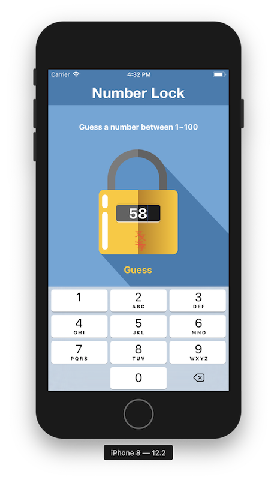
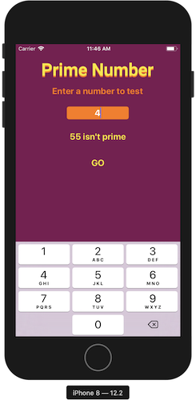

- [2019.07.05](#20190705)
  * [Udemy 深入淺出iPhone開發（使用swift 4）](#udemy-----iphone-----swift-4-)
    + [第一節 你的第一款應用程式：Hello swift](#--------------hello-swift)
    + [第二節 swift語言快速上手：基礎型別](#----swift-----------)
    + [第三節 集合型別](#--------)
    + [第四節 流程控制：做出第二款解鎖大師遊戲APP](#--------------------app)
- [2019.07.19](#20190719)
    + [第五節 重複做事情的好幫手：迴圈](#----------------)
    + [第六節 函式：呼叫我！使命必達！](#----------------)
    + [第七節 閉包：請先想成這是沒有名字的函式](#--------------------)
    + [第八節 optional 與質數判斷APP](#----optional------app)
    + [第九節 物件導向程式設計(上)](#---------------)

# 2019.07.05
## Udemy 深入淺出iPhone開發（使用swift 4）
---
### 第一節 你的第一款應用程式：Hello swift
* 申請成為開發者
* 熟悉、使用xcode
* 了解button連結 (action)
* 了解label連結 (outlet)
* `viewDidLoad()` 是在畫面剛讀入時執行
* `didReceiveMemoryWarning()` 是在記憶體不夠時執行
* 連結元件到程式碼是按住control鍵拖曳
---
### 第二節 swift語言快速上手：基礎型別
* playground
* 變數宣告 ``var a = 5``
* 常數宣告 ``let b = 2.5``
* 變數/常數+型別 
    ```swift
    var age:Int = 4
    var weight:Float = 66.6
    let pi:Double = 3.14
    ```
* 浮點數
    ```swift
    age / weight 
    //錯誤，整數不能直接除小數
    Float(age) / weight
    //須先轉型成Float，再做除法
    5/2 
    // 2，整數除整數會無條件捨去到整數位
    Double(5)/2 
    // 2.5，若要得到正確答案，須先轉型
    ```
* 布林值``var isLocked:Bool = true``

* 字串
    ```swift
    var language:String = "swift"
    let hello:String = "Hello"

    hello + " " + language
    //output: "hello swift"，連結字串用加號
    var str = "my language is \(language)"
    //output: "my language is swift"，也可以用\(變數)來加入字串
    "my language is \"swift\""
    //output: "my language is "swift""，若字串中有雙引號，要在雙引號前放上跳脫字元\

    var str = "aAbBCc"
    str.lowercased() //output: "aabbcc"
    str.uppercased() //output: "AABBCC"

    var str = """
    a b c
    d e f
    g h i
    """
    //output: "a b c\nd e f\ng h i"，多行字串用"""包起來
    ```
---
### 第三節 集合型別
* 陣列 
    ```swift
    //索引值從0開始
    var array:[String] = ["A","b","c","D","EF"]
    //索引值       0   1   2   3   4
    array[0] //output: "A"
    array[3] //output: "D"
    array[5] //錯誤，沒有5號元素

    array.count //output: 5，計算陣列有多少成員

    array.append("ghi") //array: ["A", "b", "c", "D", "EF", "ghi"]
    // array.append():在陣列後面加入新成員

    array.insert("new", at: 3) 
    // array: ["A", "b", "c","new", "D", "EF", "ghi"]
    // array.insert():在指定位址插入新成員

    array.remove(at: 2)
    // array: ["A", "b", "new", "D", "EF", "ghi"]
    // array.remove():刪除指定位置的成員

    array.removeLast()
    // array: ["A", "b", "new", "D", "EF"]
    // array.removeLast():刪除最後一個元素

    array.removeFirst()
    // array: ["b", "new", "D", "EF"]
    // array.removeFirst():刪除第一個元素

    array.append(1)
    //錯誤，array只能存放同一型別的成員

    array.reverse()
    // array: ["EF", "D", "new", "b"]
    // array.reverse():將array反轉

    var array2:[String] = ["1","2","3"]

    array = array + array2
    // array: ["EF", "D", "new", "b", "1", "2", "3"]
    // array加法：把兩個陣列連起來

    //建立空陣列的方法
    var array:[Int] = []
    var array2 = [Int]()
    ```
* 字典
    ```swift
    var e2c:[String:String] = ["one":"一","two":"二","three":"三"]
    // 鍵值對格式：key:value，每組鍵值對間用逗號隔開
    e2c["one"]   // output: "一"
    e2c["three"] // output: "三"
    e2c["two"]   // output: "二"
    e2c["ten"]   // output: nil
    // 用不存在的key取值會得到nil

    // 更新value的方法
    e2c["one"] = "壹"
    // e2c: ["one": "壹", "two": "二", "three": "三"]
    e2c.updateValue("一", forKey: "one")
    // e2c: ["one": "一", "two": "二", "three": "三"]

    // 加入新的鍵值對
    e2c["four"] = "四"
    e2c.updateValue("五", forKey: "five")
    // e2c: ["one": "一", "three": "三", "four": "四", "five": "五", "two": "二"]

    // 刪除鍵值對
    e2c["five"] = nil; // nil代表空
    e2c.removeValue(forKey: "four")
    // e2c: ["one": "一", "two": "二", "three": "三"]
    ```
---
### 第四節 流程控制：做出第二款解鎖大師遊戲APP

* if判斷式
    ```swift
    var price = 80;

    if price < 70{
        print("Very cheap")
    } else if price > 130{
        print("Are you crazy?")
    } else {
        print("buy it")
    } 

    // && : 且， || : 或
    ```
* switch
    ```swift
    var price = 80
    switch price {
    case 20...40:
        print("cheap")
    case 70,80,90:
        print("ok")
    case 200:
        print("expensive")
    default:
        print("???")
    }
    // default不可省略
    // 20...40 是指20到40都會進入這個case
    // 70,80,90 是指70,80,90這三個會進入這個case
    ```
* 解鎖大師遊戲APP
    ```swift
    // 取亂數
    import GameKit
    var answer:Int = GKRandomSource.sharedRandom().nextInt(upperBound: 100)+1

    // 修改StatusBarStyle
    override var preferredStatusBarStyle: UIStatusBarStyle{
        return .lightContent
    }

    // 修改背景圖
    @IBOutlet weak var background: UIImageView!
    background.image = UIImage(named: "Finish")

    // 修改messageLabel.text
    messageLabel.text = "Guess a number between \(min) to \(max)"
    ```


---
# 2019.07.19
### 第五節 重複做事情的好幫手：迴圈
* for loop
    ```swift
    // 格式
    for 自己設定的名字 in 陣列的名字{
        // 要執行的程式碼
    }
    let array:[Int] = [1,2,3,4,5]
    for i in array{
        print(i)
    }
    // output: "1\n2\n3\n4\n5\n"

    var array2:[Int] = []
    for i in array{
        array2.append(i+2)
    }
    // array2: [3, 4, 5, 6, 7]

    let strArr:[String] = ["Acs","CcC","ewf","cAc"]
    var strArr2:[String] = []
    for str in strArr{
        strArr2.append(str.lowercased())
    }
    // output: ["acs", "ccc", "ewf", "cac"]

    // 全閉範圍區間 1...5 指的是 (1,2,3,4,5)
    // 半壁範圍區間 1..<5 指的是 (1,2,3,4)
    for index in 1...100{
        print(index)
    }
    // 從1印到100

    // 若for 中用不到index 可將index改為_
    for _ in 1...3{
        print("HI")
    }
    // 迴圈做3次

    // 九九乘法表
    for num1 in 1..<10{
        for num2 in 1..<10{
            print("\(num1) * \(num2) = \(num1*num2)")
        }
    }

    for index in 1...10 where index%2 == 1{
        print(index)
    }
    // output: "1\n3\n5\n7\n9\n"

    // for + dictionary
    let e2c:[String:String] = ["one":"一","two":"二","three":"三"]
    for (key,value) in e2c{
        print("\(key):\(value)")
    }
    // output: "three:三\ntwo:二\none:一\n"
    ```
* tuple 元組，把很多資料用小括號包起來
    ```swift
    // (key,value) : 稱為元組(tuple)，把很多資料用小括號包起來

    let colors = ("red","orange","yellow","green")
    // 元組用 colors.0 的方式存取

    // tuple 中可存不同型別
    let tuple = ("a",12,true,3.14,[1,2,3])
    let e2c = (one:"一",two:"二",three:"三")
    e2c.one // output: "一"
    e2c.0   // output: "一"
    ```
* while loop
    ```swift
    var index = 1
    while index <= 10 {
        print(index)
        index += 1
    }

    // while + array
    let array:[Int] = [1,2,3,4,5]
    var index = 0
    while index < array.count{
        print(array[index])
        index += 1
    }

    // repeat-while
    repeat{
        print("just do it \(index) times.")
        index += 1
    }while index < 11
    // 從1印到10
    // repeat-while 即使條件不符合，最少會執行一次，類似其他的do-while
    ```
---
### 第六節 函式：呼叫我！使命必達！
* DRY:Don't Repeat Youself : 避免使用重複程式碼
* function
    ```swift
    // 定義函式 : 函式還不會執行
    func functionName(parameter){
        // 會需要重複做的事情
    }
    // 呼叫函式 ： 函式執行
    functionName(parameter)

    func eat(foodName:String){
        print("eat "+foodName)
    }
    eat(foodName: "hamburger")
    // output: eat hamburger
    eat(foodName: "pizza")
    // output: eat pizza

    // 有回傳值的函式
    func add(num1:Int,num2:Int) -> Int{
        return num1 + num2
    }
    let ans = add(num1: 2, num2: 6)

    // 沒有回傳值的寫法
    func functionName(parameter){
    }
    func functionName(parameter) -> Void{
    }
    func functionName(parameter) -> (){
    }

    // 外部參數名： withWidth、andHeight
    // 內部參數名： width、height
    func calculateArea(withWidth width:Float, andHeight height:Float) -> Float{
        return width * height
    }
    calculateArea(withWidth: 12.3, andHeight: 45.6)

    // 省略外部參數名
    func buy(_ thing:String){
        print("buy "+thing)
    }
    buy("macbook")
    ```
* 變數可視範圍
    * 大括號裡面看得到外面
        ```swift
        var a:Int = 10
        if true{
            print(a)
        }
        // output: 10
        ```
    * 大括號外面看不到裡面
        ```swift

        if true{
            let i = 12
        }
        print(i)
        // output: 5
        ```
    * 大括號創造了新的命名空間
        ```swift
        let i = 5
        if true{
            let i = 12
        }
        print(i)
        // output: 5
        ```
---
### 第七節 閉包：請先想成這是沒有名字的函式
* closure(閉包)
* 沒有外部參數名
    ```swift
    let helloClosure = {
        print("hello")
    }
    helloClosure()

    let add = {
        (num1:Int,num2:Int) -> Int in
        return num1 + num2
    }
    add(3,5)
    // closure也有型別
    // helloClosure 的型別是()->()
    // add 的型別是(Int,Int)->Int
    ```
* 可當作變數傳入函式
    ```swift
    func calculate(num1:Int,num2:Int,operation:(Int,Int)->Int){
        print(operation(num1,num2))
    }
    let add = {
        (num1:Int,num2:Int) -> Int in
        return num1 + num2
    }
    calculate(num1: 3, num2: 4, operation: add)
    ```
* 簡寫closure
    1. 已經能夠確認參數與回傳值得型別的話，可以刪除，可以刪除Closure裡面參數跟回傳值得型別
        ```swift
        // before
        let add = {
        (num1:Int,num2:Int) -> Int in
        return num1 + num2
        }
        // after
        let add:(Int,Int)->Int = {
            (num1,num2) in
            return num1 + num2
        }
        ```
    2. 程式碼只有一行的情況下可以刪除``return``
        ```swift
        // before
        let add:(Int,Int)->Int = {
            (num1,num2) in
            return num1 + num2
        }
        // after
        let add:(Int,Int)->Int = {
            (num1,num2) in num1 + num2
        }
        ```
    3. 用``$0``,``$1``,``$2``...代替傳進來的參數名稱
        ```swift
        // before
        let add:(Int,Int)->Int = {
            (num1,num2) in num1 + num2
        }
        // after
        let add:(Int,Int)->Int = { $0 + $1 }
        ```
    4. 如果是最後或是唯一個參數，可把closure放在參數小括號外
        ```swift
        // before
        let numberArrayAddTen = numberArray.map({ $0+10 })
        // after
        let numberArrayAddTen = numberArray.map(){ $0+10 }
        ```
    5. 如果是唯一個參數，可省略參數小括號
        ```swift
        // before
        let numberArrayAddTen = numberArray.map(){ $0+10 }
        // after
        let numberArrayAddTen = numberArray.map{ $0+10 }
        ```
* 陣列的 map() 方法：把陣列的每個成員拿出來做一些事情
    ```swift
    var numberArray=[1,3,5,7,9,2,4,6,8,10]
    let numberArrayAddTen = numberArray.map {$0 + 10}
    }
    // output: [11,13,15,17,19,12,14,16,18,20]
    ```
* 陣列的 filter() 方法：過濾功能
    ```swift
    var numberArray=[1,3,5,7,9,2,4,6,8,10]
    let numberArrayEven = numberArray.filter {$0 % 2 == 0}
    // output: [2, 4, 6, 8, 10]
    ```
---
### 第八節 optional 與質數判斷APP
* optional型別 (非必需的)
    ```swift
    var i:Int = 10
    // i的型別是Int，儲存10
    var j:Int = nil
    // error: j的型別是Int，無法儲存nil
    var k:Int? = nil
    // 為了儲存nil和Int，必須使用optional Int型別(Int?)
    var isLightOn:Bool? = nil; 
    // 為了儲存nil和Bool，必須使用optional Bool型別(Int?)

    var x:Int?
    // x預設為nil

    var y:Int? = 8;
    print(y)
    // output: optional(8)

    y+2
    // error: optional Int 和 Int無法相加

    var z:Int!;
    // 除了用Int?表示optional外，也可用Int!表示
    // 用Int!在程式中，都不會檢查值是否為nil，類似其他語言
    ```
* 處理optional的方法
    1. 強迫解開包裝 force unwarpping 
        ```swift
        // 在變數後加上!可以強迫解開包裝
        var x:Int? = 8
        x! + 2
        // output: 10

        var y:Int? = nil
        y! + 2
        // error
        ```
    2. 先判斷是否有值，再做後續的處理
        ```swift
        var x:Int? = 8;
        if x != nil{
            x! + 2
            // output: 10
            x = x! + 2
            // x: optional(10)
        }
        ```
    3. optional binding:最好的處理方式
        ```swift
        var x:Int? = 8;
        if let myNumber = x{
            myNumber + 2
        }

        ```
* TernaryConditionl operator(三元運算子)
    ```swift
    var x:Int? = 3
    var y:Int
    y = x != nil ? x! : 0
    //等價於下面
    if x != nil{
        y = x!
    } else {
        y = 0
    }
    ```
* Nil-Coalesing operator(空值聚合運算子)
    ```swift
    var x:Int? = 3
    var y:Int
    y = x ?? 0
    //等價於下面
    if x != nil{
        y = x!
    } else {
        y = 0
    }
    ```
* 質數判斷APP
* playground練習
    ```swift
    let inputNumber:Int = 18
    var isPrime:Bool? = true

    if inputNumber <= 0 {
        isPrime = nil
    } else if inputNumber == 1{
        isPrime = true
    } else {
        for i in 2..<inputNumber{
            if(inputNumber % i == 0) {
                isPrime = false
            }
        }
    }

    if isPrime == true {
        print("\(inputNumber) is prime")
    } else if isPrime == false{
        print("\(inputNumber) isn't prime")
    } else {
        print("reenter")
    }

    // 函數寫法
    func checkPrime(withNumber testNumber:Int) -> String{
        var isPrime:Bool? = true
        
        if testNumber <= 0 {
            isPrime = nil
        } else if testNumber == 1{
            isPrime = true
        } else {
            for i in 2..<testNumber{
                if(testNumber % i == 0) {
                    isPrime = false
                }
            }
        }
        
        
        if isPrime == true {
            return "\(testNumber) is prime"
        } else if isPrime == false{
            return "\(testNumber) isn't prime"
        } else {
            return "reenter"
        }
    }
    print(checkPrime(withNumber: inputNumber))
    ```
* ``@IBaction`` interface builder Action
* push the keyboard on :``inputTextField.becomeFirstResponder()``
* viewController.swift
    ```swift
    import UIKit

    class ViewController: UIViewController {
        
        @IBOutlet weak var inputTextField: UITextField!
        
        @IBOutlet weak var resultLabel: UILabel!
        
        override var preferredStatusBarStyle: UIStatusBarStyle{
            return .lightContent
        }
        
        @IBAction func doThePrimeTest(_ sender: UIButton) {
            // 1.把文字輸入框的文字拿出
            if let inputText = inputTextField.text, let inputNumber = Int(inputText){
                // 3.用checkPrime()得到輸出的字串
                // 4.用resultLabel顯示結果
                checkPrime(withNumber: inputNumber){
                    self.resultLabel.text = $0
                    self.resultLabel.isHidden = false
                }
            }
            inputTextField.text = ""
        }
        
        
        override func viewDidLoad() {
            super.viewDidLoad()
            // Do any additional setup after loading the view.
            // push the keyboard on
            inputTextField.becomeFirstResponder()
        }
        
        func checkPrime(withNumber testNumber:Int) -> String{
            var isPrime:Bool? = true
            
            if testNumber <= 0 {
                isPrime = nil
            } else if testNumber == 1{
                isPrime = true
            } else {
                for i in 2..<testNumber{
                    if(testNumber % i == 0) {
                        isPrime = false
                        break
                    }
                }
            }
            
            
            if isPrime == true {
                return "\(testNumber) is prime"
            } else if isPrime == false{
                return "\(testNumber) isn't prime"
            } else {
                return "reenter"
            }
        }
        
        
        func checkPrime(withNumber number:Int,andCompletionHandler handler: (String)->()){
            handler(checkPrime(withNumber: number))
        }
        
    }

    ```
* 作品截圖

---
### 第九節 物件導向程式設計(上)

