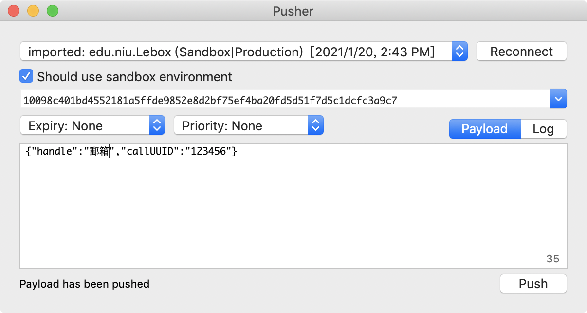

## 2020/01/24
* 預期進度：設定是否視訊 開啟郵箱 簽名檔傳伺服器
* 目前進度：

1. 推播通知
    1. 創建CSR文件
    在鑰匙串中，打開Keychain Access > Certificate Assistant > Request a Certificate From a Certificate Authority… 
    2. 傳至apple developer網站取得SSL證書
    3. xcode > Signing & Capabilities > 加上push notifications 並勾選 Automatically manage signing
    4. 在appDelegate修改加入
        ```swift
        func application(_ application: UIApplication, didFinishLaunchingWithOptions launchOptions: [UIApplication.LaunchOptionsKey: Any]?) -> Bool {
                // Override point for customization after application launch.
                
                // push notification
                UNUserNotificationCenter.current().requestAuthorization(options: [.alert, .sound, .badge]) { (granted, error) in
                }
                UIApplication.shared.registerForRemoteNotifications()
                
                return true
            }
            // when get the remote notification token
            func application(_ application: UIApplication, didRegisterForRemoteNotificationsWithDeviceToken deviceToken: Data) {
                var tokenString = ""
                for byte in deviceToken {
                let hexString = String(format: "%02x", byte)
                tokenString += hexString
                }
                print("token:\(tokenString)")
            }
        ```
    5. 取得token可傳至webservice供伺服器推播
    6. 利用 Node.js 程式當 provider server 發送推播 進行測試
        ```javascript
        var apn = require('apn');

        var options = {
            token: {
                key: "AuthKey_XGDY92M6SG.p8",
                keyId: "XGDY92M6SG",
                teamId: "7K297JDWP3"
            },
            production: false
        };

        var apnProvider = new apn.Provider(options);

        var note = new apn.Notification();
        let deviceToken = "ee14270666e3bcc44639ca199ca0cdb72866b5a349991dfdbae6e7658447afe7";
        note.alert = "你的包裹已送達";
        note.sound = "default";
        note.badge = 1;
        note.topic = "edu.niu.Lebox";
        apnProvider.send(note, deviceToken).then((result) => {
            // see documentation for an explanation of result
        });
        ```
    * 實際畫面
    
        

    * 參考資料

        [https://www.appcoda.com.tw/push-notification-ios/](https://www.appcoda.com.tw/push-notification-ios/)
        [https://www.appcoda.com.tw/push-notification/](https://www.appcoda.com.tw/push-notification/)

2. 來電自動彈出接聽畫面
    * 實作方法：
        1. 使用voip通知手機喚醒(PushKit)
        2. 將PushKit收到的通知使用CallKit呼叫系統通話畫面

    * 詳細步驟
        1. 生成 CSR 文件
        2. 生成 voip service 的證書
        3. 勾選Background Mode > voice over ip
        4. 添加 PushKit.framework 和 CallKit.framework
        5. 註冊 voip
            ```swift
            func registerForVoIPPushes() {
                let mainQueue = DispatchQueue.main
                
                voipRegistry = PKPushRegistry(queue: mainQueue)
                voipRegistry?.delegate = self
                voipRegistry?.desiredPushTypes = [.voIP]
            }
            ``` 
        6. 接收voip token
            ```swift
            func pushRegistry(_ registry: PKPushRegistry, didUpdate pushCredentials: PKPushCredentials, for type: PKPushType) {
                var tokenString = ""
                for byte in pushCredentials.token {
                    let hexString = String(format: "%02x", byte)
                    tokenString += hexString
                }
                print("voip token:\(tokenString)")
            }
            ```
        7. 串 CallKit
            ```swift
            func pushRegistry(_ registry: PKPushRegistry, didReceiveIncomingPushWith payload: PKPushPayload, for type: PKPushType, completion: @escaping () -> Void) {
            
                let backgroundTaskIdentifier = UIApplication.shared.beginBackgroundTask(expirationHandler: nil)
                
                if let handle = payload.dictionaryPayload["handle"] as? String{
                    AppDelegate.shared.displayIncomingCall(
                        uuid: UUID(),
                        handle: handle,
                        hasVideo: true
                    ) { _ in
                        UIApplication.shared.endBackgroundTask(backgroundTaskIdentifier)
                    }
                }
                
                
                
            }
            
            func displayIncomingCall(uuid: UUID,handle: String,hasVideo: Bool = false,completion: ((Error?) -> Void)?) {
                
                providerDelegate.reportIncomingCall(
                    uuid: uuid,
                    handle: handle,
                    hasVideo: hasVideo,
                    completion: completion)
            }
            ```
            詳細參考[https://juejin.im/entry/5cb877626fb9a0687a171ced](https://juejin.im/entry/5cb877626fb9a0687a171ced)

        8. 測試:使用pusher

            [https://github.com/noodlewerk/NWPusher/releases](https://github.com/noodlewerk/NWPusher/releases)

            模擬伺服器發送請求

            

            手機接收到voip通知後的動作

            


    * 參考資料

        [https://medium.com/ios-expert-series-or-interview-series/voip-push-notifications-using-ios-pushkit-5bc4a8f4d587](https://medium.com/ios-expert-series-or-interview-series/voip-push-notifications-using-ios-pushkit-5bc4a8f4d587)

        [https://stackoverflow.com/questions/43638814/ios-voip-push-notifications-pushkit](https://stackoverflow.com/questions/43638814/ios-voip-push-notifications-pushkit)

        [https://juejin.im/entry/5cb877626fb9a0687a171ced](https://juejin.im/entry/5cb877626fb9a0687a171ced)

        [https://stackoverflow.com/questions/58115125/ios-13-not-getting-voip-push-notifications-in-background](https://stackoverflow.com/questions/58115125/ios-13-not-getting-voip-push-notifications-in-background)
        
        [https://developer.apple.com/documentation/pushkit/responding_to_voip_notifications_from_pushkit](https://developer.apple.com/documentation/pushkit/responding_to_voip_notifications_from_pushkit)

* `UISwitch`顏色調整
    ```swift
    switchButton.onTintColor = UIColor.blue
    switchButton.tintColor = UIColor.red
    switchButton.thumbTintColor = UIColor.white
    switchButton.backgroundColor = UIColor.red
    switchButton.layer.cornerRadius = 16
    ```
    * 參考資料：

        [https://iosrevisited.blogspot.com/2019/06/swift-uiswitch-color-in-on-off-change-height.html](https://iosrevisited.blogspot.com/2019/06/swift-uiswitch-color-in-on-off-change-height.html)