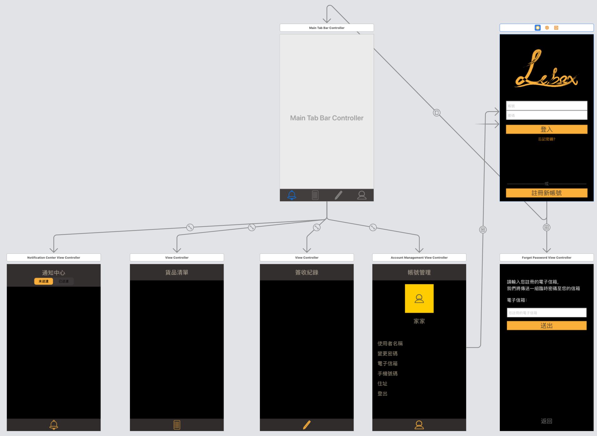
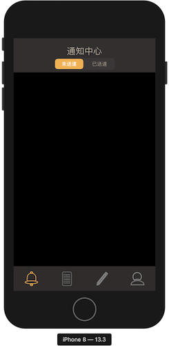

## 2020/01/17
* 預期進度：新版UI
* 目前進度：
    
    UI已依照吳家賢的設計圖繪製(下為設計圖)

    [https://xd.adobe.com/view/ea536959-2e1a-4782-764d-53f9300b4e86-9c62/](https://xd.adobe.com/view/ea536959-2e1a-4782-764d-53f9300b4e86-9c62/)

    整體預覽(在xcode下的畫面)

    

    細部頁面如下(模擬器畫面)：

    
    
    
    

1. 問題1: `UITabBar`的高度修改
    ```swift
        override func viewDidLayoutSubviews() {
            super.viewDidLayoutSubviews()
            
            var safeAreaBottomInset: CGFloat = 0.0
            
            if #available(iOS 11.0, *) {
                safeAreaBottomInset = view.safeAreaInsets.bottom
            }
            //print(safeAreaBottomInset)
            let newTabBarHeight: CGFloat = 65 + safeAreaBottomInset
            tabBar.frame.size.height = newTabBarHeight
            tabBar.frame.origin.y = view.frame.height - newTabBarHeight
        }
    ```
    * 參考資料
    
        [https://stackoverflow.com/questions/23044218/change-uitabbar-height/29132122](https://stackoverflow.com/questions/23044218/change-uitabbar-height/29132122)

2. 問題2: `UISegmentedControl`的label顏色調整
    ```swift
    segmentedControl.setTitleTextAttributes([NSAttributedString.Key.foregroundColor: UIColor.white], for: .selected)

	segmentedControl.setTitleTextAttributes([NSAttributedString.Key.foregroundColor: UIColor(red: 168/255, green: 156/255, blue: 135/255, alpha: 1)], for: .normal)
    ```
    * 參考資料
    
        [https://www.itranslater.com/qa/details/2326259084732924928](https://www.itranslater.com/qa/details/2326259084732924928)

3. 問題3: iOS 13 的 present modally 變成卡片設計
    
    在iOS 13 跳轉頁面的方式改變了，需將被跳轉的頁面的Presentation換成Full Screen即可變回上一版本的形式
    * 參考資料

        [https://medium.com/%E5%BD%BC%E5%BE%97%E6%BD%98%E7%9A%84-swift-ios-app-%E9%96%8B%E7%99%BC%E5%95%8F%E9%A1%8C%E8%A7%A3%E7%AD%94%E9%9B%86/ios-13-%E7%9A%84-present-modally-%E8%AE%8A%E6%88%90%E6%9B%B4%E6%96%B9%E4%BE%BF%E7%9A%84%E5%8D%A1%E7%89%87%E8%A8%AD%E8%A8%88-fb6b31f0e20e](https://medium.com/%E5%BD%BC%E5%BE%97%E6%BD%98%E7%9A%84-swift-ios-app-%E9%96%8B%E7%99%BC%E5%95%8F%E9%A1%8C%E8%A7%A3%E7%AD%94%E9%9B%86/ios-13-%E7%9A%84-present-modally-%E8%AE%8A%E6%88%90%E6%9B%B4%E6%96%B9%E4%BE%BF%E7%9A%84%E5%8D%A1%E7%89%87%E8%A8%AD%E8%A8%88-fb6b31f0e20e)
    