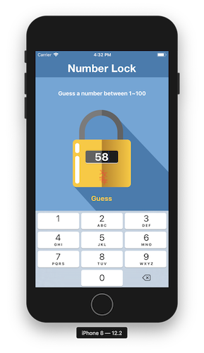

# 2019.07.05
## Udemy 深入淺出iPhone開發（使用swift 4）
---
### 第一節 你的第一款應用程式：Hello swift
* 申請成為開發者
* 熟悉、使用xcode
* 了解button連結 (action)
* 了解label連結 (outlet)
* `viewDidLoad()` 是在畫面剛讀入時執行
* `didReceiveMemoryWarning()` 是在記憶體不夠時執行
* 連結元件到程式碼是按住control鍵拖曳
---
### 第二節 swift語言快速上手：基礎型別
* playground
* 變數宣告 ``var a = 5``
* 常數宣告 ``let b = 2.5``
* 變數/常數+型別 
    ```swift
    var age:Int = 4
    var weight:Float = 66.6
    let pi:Double = 3.14
    ```
* 浮點數
    ```swift
    age / weight 
    //錯誤，整數不能直接除小數
    Float(age) / weight
    //須先轉型成Float，再做除法
    5/2 
    // 2，整數除整數會無條件捨去到整數位
    Double(5)/2 
    // 2.5，若要得到正確答案，須先轉型
    ```
* 布林值``var isLocked:Bool = true``

* 字串
    ```swift
    var language:String = "swift"
    let hello:String = "Hello"

    hello + " " + language
    //output: "hello swift"，連結字串用加號
    var str = "my language is \(language)"
    //output: "my language is swift"，也可以用\(變數)來加入字串
    "my language is \"swift\""
    //output: "my language is "swift""，若字串中有雙引號，要在雙引號前放上跳脫字元\

    var str = "aAbBCc"
    str.lowercased() //output: "aabbcc"
    str.uppercased() //output: "AABBCC"

    var str = """
    a b c
    d e f
    g h i
    """
    //output: "a b c\nd e f\ng h i"，多行字串用"""包起來
    ```
---
### 第三節 集合型別
* 陣列 
    ```swift
    //索引值從0開始
    var array:[String] = ["A","b","c","D","EF"]
    //索引值       0   1   2   3   4
    array[0] //output: "A"
    array[3] //output: "D"
    array[5] //錯誤，沒有5號元素

    array.count //output: 5，計算陣列有多少成員

    array.append("ghi") //array: ["A", "b", "c", "D", "EF", "ghi"]
    // array.append():在陣列後面加入新成員

    array.insert("new", at: 3) 
    // array: ["A", "b", "c","new", "D", "EF", "ghi"]
    // array.insert():在指定位址插入新成員

    array.remove(at: 2)
    // array: ["A", "b", "new", "D", "EF", "ghi"]
    // array.remove():刪除指定位置的成員

    array.removeLast()
    // array: ["A", "b", "new", "D", "EF"]
    // array.removeLast():刪除最後一個元素

    array.removeFirst()
    // array: ["b", "new", "D", "EF"]
    // array.removeFirst():刪除第一個元素

    array.append(1)
    //錯誤，array只能存放同一型別的成員

    array.reverse()
    // array: ["EF", "D", "new", "b"]
    // array.reverse():將array反轉

    var array2:[String] = ["1","2","3"]

    array = array + array2
    // array: ["EF", "D", "new", "b", "1", "2", "3"]
    // array加法：把兩個陣列連起來

    //建立空陣列的方法
    var array:[Int] = []
    var array2 = [Int]()
    ```
* 字典
    ```swift
    var e2c:[String:String] = ["one":"一","two":"二","three":"三"]
    // 鍵值對格式：key:value，每組鍵值對間用逗號隔開
    e2c["one"]   // output: "一"
    e2c["three"] // output: "三"
    e2c["two"]   // output: "二"
    e2c["ten"]   // output: nil
    // 用不存在的key取值會得到nil

    // 更新value的方法
    e2c["one"] = "壹"
    // e2c: ["one": "壹", "two": "二", "three": "三"]
    e2c.updateValue("一", forKey: "one")
    // e2c: ["one": "一", "two": "二", "three": "三"]

    // 加入新的鍵值對
    e2c["four"] = "四"
    e2c.updateValue("五", forKey: "five")
    // e2c: ["one": "一", "three": "三", "four": "四", "five": "五", "two": "二"]

    // 刪除鍵值對
    e2c["five"] = nil; // nil代表空
    e2c.removeValue(forKey: "four")
    // e2c: ["one": "一", "two": "二", "three": "三"]
    ```
---
### 第四節 流程控制：做出第二款解鎖大師遊戲APP

* if判斷式
    ```swift
    var price = 80;

    if price < 70{
        print("Very cheap")
    } else if price > 130{
        print("Are you crazy?")
    } else {
        print("buy it")
    } 

    // && : 且， || : 或
    ```
* switch
    ```swift
    var price = 80
    switch price {
    case 20...40:
        print("cheap")
    case 70,80,90:
        print("ok")
    case 200:
        print("expensive")
    default:
        print("???")
    }
    // default不可省略
    // 20...40 是指20到40都會進入這個case
    // 70,80,90 是指70,80,90這三個會進入這個case
    ```
* 解鎖大師遊戲APP
    ```swift
    // 取亂數
    import GameKit
    var answer:Int = GKRandomSource.sharedRandom().nextInt(upperBound: 100)+1

    // 修改StatusBarStyle
    override var preferredStatusBarStyle: UIStatusBarStyle{
        return .lightContent
    }

    // 修改背景圖
    @IBOutlet weak var background: UIImageView!
    background.image = UIImage(named: "Finish")

    // 修改messageLabel.text
    messageLabel.text = "Guess a number between \(min) to \(max)"
    ```


---
