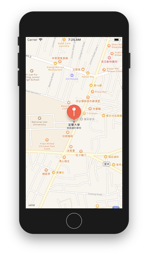

# 2019.08.16
### 第十四節 多媒體：播放音樂
* enum(列舉):enumberation
    * 已知型別可以省略型別
    ```swift
    // 宣告列舉
    enum Direction{
        case east
        case west
        case south
        case north
    }
    // 因為myDirection有宣告型別Direction，所以後面的Direction.north可以省略為.north
    let myDirection:Direction = .north

    // 以下為沒有enum的程式寫法
    func whichDirectionToGo(direction:String) {
        if direction == "east" {
            print("go east");
        } else if direction == "west" {
            print("go west");
        } else if direction == "south" {
            print("go south");
        } else if direction == "north" {
            print("go north");
        }
    }
    // 這種寫法有時會不小心打錯字，造成錯誤
    whichDirectionToGo(direction: "esat")

    // 以下為enum寫法
    func whichDirectionToGo(direction:Direction) {
        if direction == .east {
            print("go east");
        } else if direction == .west {
            print("go west");
        } else if direction == .south {
            print("go south");
        } else if direction == .north {
            print("go north");
        }
    }
    // 這種寫法可以用.然後再選擇，就不會有打錯字的問題
    whichDirectionToGo(direction: myDirection)
    whichDirectionToGo(direction: .south)

    import UIKit
    // 之前用到的UIAlertController()就有用到.alert即是UIAlertController.Style.alert之縮寫
    UIAlertController(title: "hello", message: nil, preferredStyle: UIAlertController.Style.alert)
    UIAlertController(title: "hello", message: nil, preferredStyle: .alert)

    ```
* 錯誤處理
    * 有`throws`的方法，要配合`try`,`do`,`catch`使用
    ```swift
    enum NameInputError:Error{
        case empty
        case isNumber
        
    }

    func getUserFullname(firstname:String,lastname:String) throws -> String{
        if firstname == ""||lastname == ""{
            throw NameInputError.empty
        } else if Int(firstname) != nil || Int(lastname) != nil{
            throw NameInputError.isNumber
        }
        let fullname = firstname + " " + lastname
        return fullname
    }

    do{
        try getUserFullname(firstname: "ian", lastname: "")
    }catch NameInputError.empty{
        print("empty name")
    }catch NameInputError.isNumber{
        print("input some number")
    }catch {
        print("something is wrong")
    }
    // output: empty name
    ```
* 播放音效
    1. `import AVFoundation`
    2. 找到音檔路徑
    3. `URL(fileURLWithPath: path)`
    4. make an `audioPlayer:AVAudioPlayer?`
    5. 調整參數
        * 調整音樂播放速度
        * 重複播放音樂的次數
        * 調整音量
    * 用按鈕播放時，若要每次按下都重頭播放，需先停止上次的播放，將`currentTime`設為0，再播放
    ```swift
    import UIKit
    // 引入這個函式庫方便播放音效
    import AVFoundation

    class ViewController: UIViewController {

        var audioPlayer:AVAudioPlayer?
        @IBAction func play(_ sender: UIButton) {
            audioPlayer?.stop()
            audioPlayer?.currentTime = 0.0
            audioPlayer?.play()
        }
        override func viewDidLoad() {
            super.viewDidLoad()
            // 找到音檔路徑
            if let path = Bundle.main.path(forResource: "Right", ofType: "mp3"){
                // path to url
                let url = URL(fileURLWithPath: path)
                // make an audio player
                do{
                    audioPlayer = try AVAudioPlayer(contentsOf: url)
                    // 調整音樂播放速度
                    // 1. 開啟enableRate
                    // 2. 調整rate
                    audioPlayer?.enableRate = true
                    // audioPlayer?.rate = 0.5
                    
                    // 重複播放音樂的次數
                    // 預設為0  => 播放1次
                    // 調整為1  => 播放2次
                    // 調整為-1 => 不斷播放
                    audioPlayer?.numberOfLoops = -1;
                    
                    // 調整音量
                    // 預設為1
                    audioPlayer?.volume = 0.3
                }catch {
                    print(error.localizedDescription)
                }
            } else {
                print("no such file")
            }
            // 上述if optional binding可以寫成下面這樣
            // 差別是if 的 path可視範圍較小
            // guard 的 newPath可視範圍較大
            guard let newPath = Bundle.main.path(forResource: "Right", ofType: "mp3") else {
                print("no such file")
                return
            }
            do{
                audioPlayer = try AVAudioPlayer(contentsOf: URL(fileURLWithPath: newPath))
            }catch {
                print(error.localizedDescription)
            }
        }
    }
    ```
---
### 第十五節 地圖與物件導向程式設計(下)
* 結構(struct)
    * 基本寫法
    ```swift
    struct Size{
        var width:Float = 5.0
        var height:Float = 8.0
        
        func area()->Float{
            return width*height;
        }
    }
    //不用init()
    var aSize:Size = Size(width: 20.3, height: 45.6)

    aSize.width
    aSize.height = 12.3

    var newSize = Size()
    newSize.area()

    struct Name{
        var firstname:String
        var lastname:String
        func fullname()->String{
            return firstname+" "+lastname
        }
    }

    let myName = Name(firstname: "ian", lastname: "lu")
    myName.fullname()

    ```
    * `struct` 與 `class`不同之處
        1. `struct`不能有子類別`class`可以
        2. `struct`是`value type`，`class`是`refernce type`
        3. `struct`儲存簡單資料;`class`儲存與操作資料
* 實機測試
    1. 更新iPhone作業系統到最新
    2. 接線
    3. xcode 上選手機
    4. 等 5-10 分鐘
* 地圖
    * 大頭針
    * 長按
    * 設定地圖region方法
        1. 設定緯度 `latitude:CLLocationDegrees`
        2. 設定經度 `longitude:CLLocationDegrees`
        3. 利用緯度和經度生成 `location:CLLocationCoordinate2D`
        4. 設定x方向放大倍率 `xScale:CLLocationDegrees`
        5. 設定y方向放大倍率 `yScale:CLLocationDegrees`
        6. 利用x,y放大倍率生成 `span:MKCoordinateSpan`
        7. 利用location,span生成 `region:MKCoordinateRegion`
        8. 設定地圖的region `map.setRegion()`

    ```swift
    import UIKit
    import MapKit

    class ViewController: UIViewController {
        @IBOutlet weak var map: MKMapView!
        
        
        // 長按執行
        // 1. storyboard 加入 LongPressGestureRecognizer
        // 2. action 連結到ViewController
        @IBAction func addMeAnnotation(_ sender: UILongPressGestureRecognizer) {
            let touchPoint = sender.location(in: map)
            let touchCoordinate:CLLocationCoordinate2D = map.convert(touchPoint, toCoordinateFrom: map)
            
            // 建立大頭針
            let annotation = MKPointAnnotation()
            annotation.coordinate = touchCoordinate
            annotation.title = "新的地點"
            annotation.subtitle = "這是哪裡？"
            map.addAnnotation(annotation);
            
        }
        override func viewDidLoad() {
            super.viewDidLoad()
            // Do any additional setup after loading the view.
            let latitude:CLLocationDegrees = 24.746211
            let longitude:CLLocationDegrees = 121.748843
            let location:CLLocationCoordinate2D = CLLocationCoordinate2D(latitude: latitude, longitude: longitude)
            
            let xScale:CLLocationDegrees = 0.005
            let yScale:CLLocationDegrees = 0.005
            let span:MKCoordinateSpan = MKCoordinateSpan(latitudeDelta: yScale, longitudeDelta: xScale)
            
            let region:MKCoordinateRegion = MKCoordinateRegion(center: location, span: span)
            // 設定地圖區域
            map.setRegion(region, animated: true)
            // 設定顯示模式
            map.mapType = .standard
            
            let annotation = MKPointAnnotation()
            annotation.coordinate = location
            annotation.title = "宜蘭大學"
            annotation.subtitle = "我就讀的學校"
            map.addAnnotation(annotation);
            
        }
    }
    ```
    * 顯示地圖，長按顯示大頭針

    
    
* 追蹤使用者位置
    ```swift
    import UIKit
    import MapKit
    // 追蹤location需引入
    import CoreLocation

    class ViewController: UIViewController,CLLocationManagerDelegate {
        @IBOutlet weak var map: MKMapView!
        
        var locationManager:CLLocationManager?
	
	
        override func viewDidLoad() {
            super.viewDidLoad()
            // Do any additional setup after loading the view.
            locationManager = CLLocationManager()
            // 要求使用者授權
            // 要先在info.plist新增
            // Privacy - Location When In Use Usage Description
            // 並寫上我們需要授權的理由
            // get location info to show you good services
            locationManager?.requestWhenInUseAuthorization()
            
            // 設定self是locationManager的delegate
            // self需先服從CLLocationManagerDelegate
            locationManager?.delegate = self
            // 設定精準度，有 ... 等
            // kCLLocationAccuracyBest
            // kCLLocationAccuracyKilometer
            // kCLLocationAccuracyHundredMeters
            locationManager?.desiredAccuracy = kCLLocationAccuracyBest
            
            // 追蹤模式
            // apple會依據不同模式調整省電模式
            locationManager?.activityType = .automotiveNavigation
            // 開始更新location
            locationManager?.startUpdatingLocation()
            
            
            if let coordinate = locationManager?.location?.coordinate{
			
                let xScale:CLLocationDegrees = 0.01
                let yScale:CLLocationDegrees = 0.01
                let span:MKCoordinateSpan = MKCoordinateSpan(latitudeDelta: yScale, longitudeDelta: xScale)
                let region = MKCoordinateRegion(center: coordinate, span: span)
                map.setRegion(region, animated: true)
            }
            map.userTrackingMode = .followWithHeading
        }
        
        // 取得目前座標
        func locationManager(_ manager: CLLocationManager, didUpdateLocations locations: [CLLocation]) {
            print("---------------")
            print(locations[0].coordinate.latitude)
            print(locations[0].coordinate.longitude)
        }
        // 離開畫面時
        override func viewDidDisappear(_ animated: Bool) {
            // 停止更新使用者座標
            locationManager?.stopUpdatingLocation()
        }
    }
    ```
    * 請求授權

    

    * 追蹤位置

    
