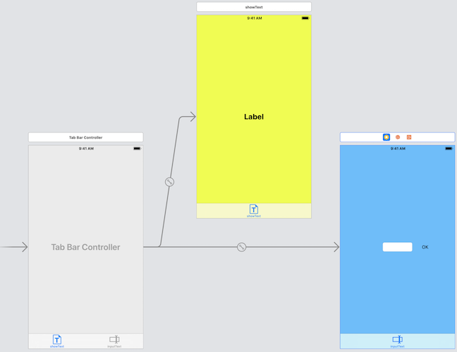
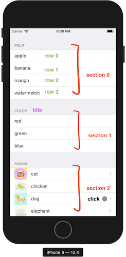
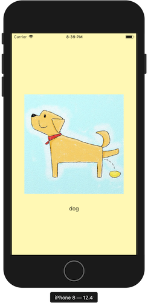
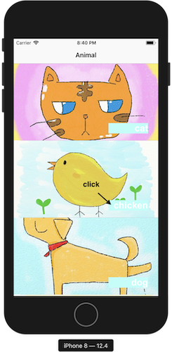
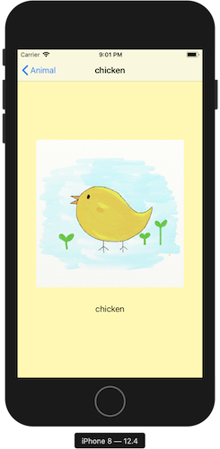
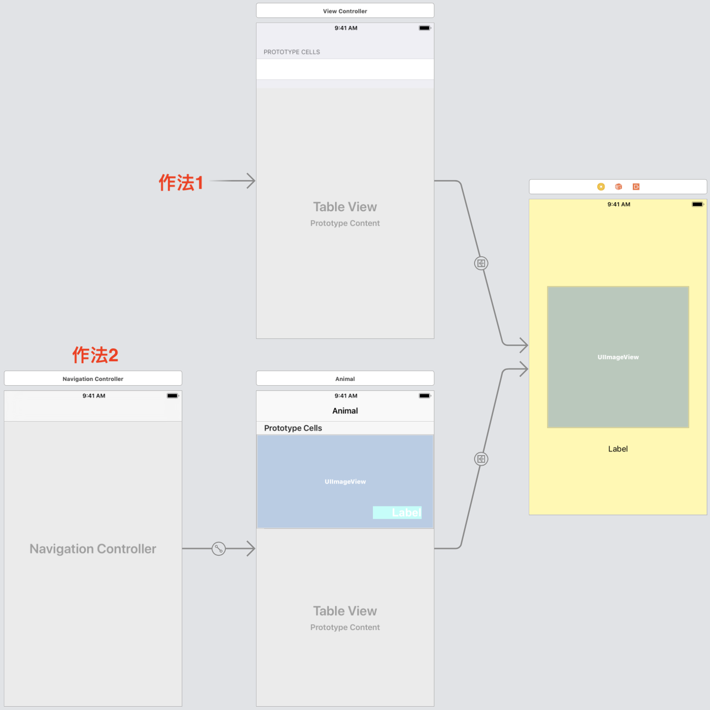

# 2019.08.30
### 第十六節 多頁面的Tabbed Application 應用程式
* 建立方法
    * 方法1
        1. 開啟Tabbed App新專案
        2. 打開`Main.storyboard`
        3. 搜尋viewController並加入
        4. 在Tab Bar Controller上按右鍵，controllers拉到想要加入的viewController
        5. 設定各畫面的class
    * 方法2
        1. 開啟Single App新專案
        2. 打開`Main.storyboard`
        3. 選取viewController
        4. xcode>editor>embed in>Tab Bar Controller
        5. 搜尋viewController並加入
        6. 在Tab Bar Controller上按右鍵，controllers拉到想要加入的viewController
        7. 設定各畫面的class
* 更改Tab Bar圖示
    * Tab Bar item>system item
    * or
    * 匯入圖檔>選擇image
* Tab item間資料傳送
* 用程式碼跳轉頁面
* code
```swift
class ViewController: UIViewController {
	@IBOutlet weak var myLabel: UILabel!
	
	override func viewDidLoad() {
		super.viewDidLoad()
		myLabel.text = "First View"
		if let secondViewController = self.tabBarController?.viewControllers?[1] as? NewViewController {
			// 和第二個畫面溝通
			// 注意：此時第二個畫面還沒產生，不可直接操作第二個畫面的元件
			secondViewController.messageFromViewOne = "hi"
		}
	}
}
class NewViewController: UIViewController {
	var messageFromViewOne:String?
	
	@IBOutlet weak var myTextInput: UITextField!
	
	@IBAction func ok(_ sender: UIButton) {
		if let inputText = myTextInput.text{
			print(inputText)
			myTextInput.text = ""
			// 讓鍵盤消失
			myTextInput.resignFirstResponder()
			// self.tabBarController 代表這個頁面的上一層，也就是tabBarController
			// .viewControllers?[0] 代表 tabBarController 下的第一個頁面
			// as? ViewController 把第一個頁面當成 ViewController 來看
			if let firstViewController = self.tabBarController?.viewControllers?[0] as? ViewController {
				firstViewController.myLabel.text = inputText
				
				// 跳轉到第1個頁面
				self.tabBarController?.selectedIndex = 0
			}
		}
	}
	override func viewDidLoad() {
        super.viewDidLoad()
		myTextInput.text = messageFromViewOne
    }
	override func viewDidAppear(_ animated: Bool) {
		super.viewDidAppear(animated)
		// 讓鍵盤彈入
		myTextInput.becomeFirstResponder()
	}
}
```
* `main.storyboard`

### 第十七節 多場景應用程式：導覽控制器
* 轉換場景的第一個方法
    1. 新增一個view controller
    2. 在view1新增一個button
    3. 按著control從button拉到view2
    4. 選擇show
    * 以下可選，差別在於back按鍵和轉場效果改為又到左
    1. 選擇第一個view controller
    2. xcode>editor>embed in>Navigation Controller

* 轉換場景的第二個方法
    1. 搜尋Navigation Controller並加入
    2. 按著control從Navigation Controller拉到view Controller
    3. 選擇 root view controller
    4. 勾選 Navigation Controller 的 is initial view controller
    5. 新增 bar button item
    6. 按著control從bar button item拉到view2
    * 以下可選，差別在於頁面標題與back按鍵的文字
    1. 新增 Navigation item 到 view2
    2. 即可更改 view2 的 title

* 轉換場景的第三個方法
    * 上下式轉場，沒有Navigation Controller的程式碼作法
    1. 設定 storyboard id
    2. 新增兩個view controller : view1、view2
    3. 在view1新增button事件加入如下：
        ```swift 
        // 按下按鈕可跳轉到 view2
        // 1. 找到view2
        // 2. present view2

        let view2 = UIStoryboard(name: "Main", bundle: nil).instantiateViewController(withIdentifier: "view2的storyboard id")
            
        present(view2), animated: true, completion: nil)
        ```
    4. 在view2新增button事件加入如下：
        ```swift
        // 按下按鈕可回到上一層
        dismiss(animated: true, completion: nil)
        ```
* 轉換場景的第四個方法
    * 左右式轉場，有Navigation Controller的程式碼作法
    1. 設定 storyboard id
    2. 新增兩個view controller : view1、view2
    3. 選擇view1
    4. xcode>editor>embed in>Navigation Controller
    5. 在view1新增button事件加入如下：
        ```swift 
        // 按下按鈕可跳轉到 view2
        // 1. 找到view2
        // 2. push view2

        let view2 = UIStoryboard(name: "Main", bundle: nil).instantiateViewController(withIdentifier: "view2的storyboard id")
            
        navigationController?.pushViewController(view2, animated: true)
        ```
    6. 在view2新增button事件加入如下：
        ```swift
        // 按下按鈕可(二擇一)

        // 回到上個畫面
		navigationController?.popViewController(animated: true)

		// 回到根畫面
		navigationController?.popToRootViewController(animated: true)
        ```
* 轉換場景的第五個方法
    1. 新增兩個view controller : view1、view2
    2. 按著control從view1拉到view2
    3. 選擇show
    4. 選擇 view1 到 view2 的 segue
    5. storyboard segue > identifier
    6. 填入 segue 的 id
    7. 在 view1 新增按鈕事件：
        ```swift 
        performSegue(withIdentifier: "gotoview2", sender: nil)
        ```

* 從 view1 傳值到 view2
    * `ViewController.swift`(view1)
    ```swift
    import UIKit

    class ViewController: UIViewController {
        
        @IBOutlet weak var myTextInput: UITextField!
        
        @IBAction func changeView(_ sender: UIButton) {
            if let inputText = myTextInput.text {
                if inputText == "" {
                    // no input, pop up an alert
                    let myAlert = UIAlertController(title: "No Input", message: "Please enter something", preferredStyle: .alert)
                    
                    let okAction = UIAlertAction(title: "OK", style: .default, handler: nil)
                    
                    myAlert.addAction(okAction)
                    present(myAlert, animated: true, completion: nil)
                } else {
                    // change view
                    
                    performSegue(withIdentifier: "gotoview2", sender: inputText)
                }
            }
        }
        override func prepare(for segue: UIStoryboardSegue, sender: Any?) {
            // 確認 segue.identifier
            if segue.identifier == "gotoview2" {
                // 把 segue.destination 轉成 view2 的classname
                if let lightRed = segue.destination as? LightRedViewController {
                    // 傳值到view2的變數上
                    lightRed.infoFromViewOne = sender as? String
                }
            }
        }
        override func viewDidLoad() {
            super.viewDidLoad()
        }
    }
    ```
    * `LightRedViewController.swift`(view2)
    ```swift
    import UIKit

    class LightRedViewController: UIViewController {
        
        var infoFromViewOne:String?
        
        @IBOutlet weak var myLabel: UILabel!
        
        override func viewDidLoad() {
            super.viewDidLoad()
            myLabel.text = infoFromViewOne
        }
    }
    ```
* 從 view2 傳值到 view1
    * 概要 : delegate, protocol
    * `LightRedViewController.swift`(view2)
    ```swift
    import UIKit

    protocol LightRedViewControllerDelegate {
        func setColor(colorType:String)
    }

    class LightRedViewController: UIViewController,UIPickerViewDataSource,UIPickerViewDelegate {
        
        var infoFromViewOne:String?
        let colorArray = ["red","green","blue"]
        var delegate:LightRedViewControllerDelegate?
        
        @IBOutlet weak var myPickerView: UIPickerView!
        @IBAction func backToViewOne(_ sender: UIButton) {
            navigationController?.popViewController(animated: true)
            let colorNumber = myPickerView.selectedRow(inComponent: 0)
            let color = colorArray[colorNumber]
            delegate?.setColor(colorType: color)
        }
        @IBOutlet weak var myLabel: UILabel!
        
        override func viewDidLoad() {
            super.viewDidLoad()
            myLabel.text = infoFromViewOne
            myPickerView.dataSource = self
            myPickerView.delegate = self
        }
        

        func numberOfComponents(in pickerView: UIPickerView) -> Int {
            return 1
        }
        
        func pickerView(_ pickerView: UIPickerView, numberOfRowsInComponent component: Int) -> Int {
            return colorArray.count
        }
        
        func pickerView(_ pickerView: UIPickerView, titleForRow row: Int, forComponent component: Int) -> String? {
            return colorArray[row]
        }
    }
    ```
    * `ViewController.swift`(view1)
    ```swift
    import UIKit

    class ViewController: UIViewController,LightRedViewControllerDelegate {
        func setColor(colorType: String) {
            if colorType == "red" {
                view.backgroundColor = .red
            } else if colorType == "green" {
                view.backgroundColor = .green
            } else if colorType == "blue" {
                view.backgroundColor = .blue
            }
        }
        
        
        @IBOutlet weak var myTextInput: UITextField!
        
        @IBAction func changeView(_ sender: UIButton) {
            if let inputText = myTextInput.text {
                if inputText == "" {
                    // no input, pop up an alert
                    let myAlert = UIAlertController(title: "No Input", message: "Please enter something", preferredStyle: .alert)
                    
                    let okAction = UIAlertAction(title: "OK", style: .default, handler: nil)
                    
                    myAlert.addAction(okAction)
                    present(myAlert, animated: true, completion: nil)
                } else {
                    // change view
                    performSegue(withIdentifier: "gotoview2", sender: inputText)
                    // clear text
                    myTextInput.text = ""
                    myTextInput.resignFirstResponder()
                }
            }
        }
        
        override func prepare(for segue: UIStoryboardSegue, sender: Any?) {
            // 確認 segue.identifier
            if segue.identifier == "gotoview2" {
                // 把 segue.destination 轉成 view2 的classname
                if let lightRed = segue.destination as? LightRedViewController {
                    // 傳值到view2的變數上
                    lightRed.infoFromViewOne = sender as? String
                    lightRed.delegate = self
                }
            }
        }
        
        override func viewDidLoad() {
            super.viewDidLoad()
            // Do any additional setup after loading 2the view.
        }
    }
    ```
### 第十八節 顯示資料必學：表格視圖
* table view 包含：
    * section
    * cell
* 流程 (不含table view controller)
    * 新增 tableview
    * 設定 tableview > dataSource 為 view controller
    * 設定 tableview > dataDelegate 為 view controller
    * view controller 服從 UITableViewDataSource,UITableViewDelegate 這兩個協定
    * 
    * table view > prototype cell:1 > 設定 cell 的 identifier
    * 若多個 section 要將 table view 的 style 改為 grouped
* 流程 (含table view controller)
    * 新增 table view controller
    * new file > cocoa touch class > table view controller
    * 將 Main.storyboard 的table view controller 連結至上步驟程式碼
    * 設定 tableViewController.swift

* 調整 prototype cell
    * Accessory : 右邊圖示
    * table view 的 row height : 每個cell的高度
    * 可以拉元件到 content view 做其他layout

* 作法1:
    * 成品
        
        
    * ViewController.swift
    ```swift

    import UIKit

    class ViewController: UIViewController,UITableViewDataSource,UITableViewDelegate {
        
        let fruitArray = ["apple","banana","mango","watermelon"]
        let colorArray = ["red","green","blue"]
        let animalArray = ["cat","chicken","dog","elephant","fox","goat","kangaroo","monkey","mouse","penguin","rabbit","snail"]

        @IBOutlet weak var myTableView: UITableView!
        override func viewDidLoad() {
            super.viewDidLoad()
            // Do any additional setup after loading the view.
        }

        // 幾個 section
        func numberOfSections(in tableView: UITableView) -> Int {
            return 3
        }
        
        // 幾個 row
        func tableView(_ tableView: UITableView, numberOfRowsInSection section: Int) -> Int {
            if section == 0 {
                return fruitArray.count
            } else if section == 1 {
                return colorArray.count
            } else {
                return animalArray.count
            }
        }
        
        // 生出在這個 indexPath 的 UITableViewCell
        // indexPath.section
        // indexPath.row
        func tableView(_ tableView: UITableView, cellForRowAt indexPath: IndexPath) -> UITableViewCell {
            
            // let cell = UITableViewCell()
            // 回收舊的 table view cell or 生成新的 table view cell
            let cell = tableView.dequeueReusableCell(withIdentifier: "cell", for: indexPath)
            
            if indexPath.section == 0 {
                cell.textLabel?.text = fruitArray[indexPath.row]
            } else if indexPath.section == 1 {
                cell.textLabel?.text = colorArray[indexPath.row]
            } else {
                cell.textLabel?.text = animalArray[indexPath.row]
                cell.imageView?.image = UIImage(named: animalArray[indexPath.row])
                cell.accessoryType = .disclosureIndicator
            }
            return cell
        }
        
        // 加入每個 section 的標題
        func tableView(_ tableView: UITableView, titleForHeaderInSection section: Int) -> String? {
            if section == 0 {
                return "Fruit"
            } else if section == 1 {
                return "color"
            } else {
                return "animal"
            }
        }
        
        func tableView(_ tableView: UITableView, didSelectRowAt indexPath: IndexPath) {
            if indexPath.section == 2 {
                performSegue(withIdentifier: "showDetail", sender: nil)
            }
        }
        
        override func prepare(for segue: UIStoryboardSegue, sender: Any?) {
            if segue.identifier == "showDetail" {
                // 確認目的地是否為 DetailViewController
                let dvc = segue.destination as? DetailViewController
                
                // 設定目的地的資料，需先找出按下之 cell 的 indexPath, row
                // 在藉由 animalArray 轉成 String
                let selectedIndexPath = myTableView.indexPathForSelectedRow
                if let selectedRow = selectedIndexPath?.row {
                    dvc?.infoFormViewOne = animalArray[selectedRow]
                    dvc?.navigationItem.title = animalArray[selectedRow]
                }
            }
        }
    }

    ```
    * DetailViewController.swift
    ```swift
    import UIKit

    class DetailViewController: UIViewController {
        
        var infoFormViewOne:String?
        
        @IBOutlet weak var myImageView: UIImageView!
        
        @IBOutlet weak var myLabel: UILabel!
        override func viewDidLoad() {
            super.viewDidLoad()

            myLabel.text = infoFormViewOne
            if let okFileName = infoFormViewOne {
                myImageView.image = UIImage(named: okFileName)
            }
        }
    }
    ```
* 作法2
    * 成品
        
        
    * AnimalTableViewController.swift
    ```swift
    import UIKit

    class AnimalTableViewController: UITableViewController {
        // 隱藏狀態列
        //	override var prefersStatusBarHidden: Bool{
        //		return true
        //	}
        
        let animalArray = ["cat","chicken","dog","elephant","fox","goat","kangaroo","monkey","mouse","penguin","rabbit","snail"]
        
        override func viewDidLoad() {
            super.viewDidLoad()
        }

        // MARK: - Table view data source

        override func numberOfSections(in tableView: UITableView) -> Int {
            // #warning Incomplete implementation, return the number of sections
            return 1
        }

        override func tableView(_ tableView: UITableView, numberOfRowsInSection section: Int) -> Int {
            // #warning Incomplete implementation, return the number of rows
            return animalArray.count
        }

        
        override func tableView(_ tableView: UITableView, cellForRowAt indexPath: IndexPath) -> UITableViewCell {
            if let cell = tableView.dequeueReusableCell(withIdentifier: "cell", for: indexPath) as? SpecialTableViewCell {
                
                // Configure the cell...
                cell.specialLabel.text = animalArray[indexPath.row]
                cell.specialImageView.image = UIImage(named: animalArray[indexPath.row])
                
                return cell
                
            } else {
                let cell = UITableViewCell()
                cell.textLabel?.text = animalArray[indexPath.row]
                cell.imageView?.image = UIImage(named: animalArray[indexPath.row])
                
                return cell
            }

            
        }

        // 	當使用者按下在 indexPath 的 cell 時，要做的事
        override func tableView(_ tableView: UITableView, didSelectRowAt indexPath: IndexPath) {
            performSegue(withIdentifier: "showDetail", sender: nil)
        }

        // 	準備傳給下個 view 的資訊
        override func prepare(for segue: UIStoryboardSegue, sender: Any?) {
            if segue.identifier == "showDetail" {
                // 確認目的地是否為 DetailViewController
                let dvc = segue.destination as? DetailViewController
                
                // 設定目的地的資料，需先找出按下之 cell 的 indexPath, row
                // 在藉由 animalArray 轉成 String
                let selectedIndexPath = self.tableView.indexPathForSelectedRow
                if let selectedRow = selectedIndexPath?.row {
                    dvc?.infoFormViewOne = animalArray[selectedRow]
                    dvc?.navigationItem.title = animalArray[selectedRow]
                }
            }
        }
    }
    ```
    * SpecialTableViewCell.swift
    ```swift
    import UIKit

    class SpecialTableViewCell: UITableViewCell {
        @IBOutlet weak var specialImageView: UIImageView!
        
        @IBOutlet weak var specialLabel: UILabel!
        override func awakeFromNib() {
            super.awakeFromNib()
            // Initialization code
        }

        override func setSelected(_ selected: Bool, animated: Bool) {
            super.setSelected(selected, animated: animated)

            // Configure the view for the selected state
        }

    }
    ```

* 作法1 & 作法2 的 `Main.storyboard`

