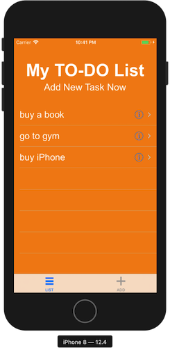
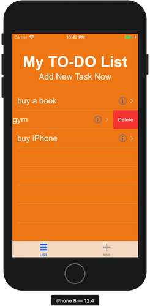
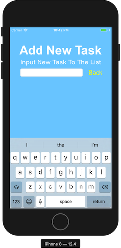

# 2019.09.20
### 第十九節 儲存資料與第七款應用程式：待辦清單
* 製作應用程式的步驟
    1. 確定功能
    2. 畫好分鏡圖
    3. 拆成很多小問題
    4. 搜尋與解決
    5. 從小的App開始做

* 儲存資料到手機
    ```swift
    import UIKit

    class ViewController: UIViewController {

        override func viewDidLoad() {
            super.viewDidLoad()
            
            // save info to UserDefaults
            // UserDefaults.standard.set("Ian Lu", forKey: "name")
            
            if let loadedName = UserDefaults.standard.value(forKey: "name") as? String{
                print(loadedName)
            }
            
    //		let fruitArray = ["apple","banana","mango"]
    //		UserDefaults.standard.set(fruitArray, forKey: "sweetFruit")
            
            if let sweetFruit = UserDefaults.standard.value(forKey: "sweetFruit") as? [String]{
                print(sweetFruit)
            }
            
        }


    }
    ```
* 待辦清單 App
    * `FirstViewController.swift`
    ```swift
    import UIKit

    class FirstViewController: UIViewController,UITableViewDataSource,UITableViewDelegate {

        override var preferredStatusBarStyle: UIStatusBarStyle{
            return .lightContent
        }
        
        @IBOutlet weak var myTableView: UITableView!
        var toDos = UserDefaults.standard.stringArray(forKey: "todos") ?? [String]()
        
        
        override func viewDidLoad() {
            super.viewDidLoad()
            myTableView.dataSource = self
            myTableView.delegate = self
            
            //if let loadedTodos = UserDefaults.standard.stringArray(forKey: "todos") {
            //	toDos = loadedTodos
            //}
        }

        func numberOfSections(in tableView: UITableView) -> Int {
            return 1
        }
        func tableView(_ tableView: UITableView, numberOfRowsInSection section: Int) -> Int {
            return toDos.count
        }
        func tableView(_ tableView: UITableView, cellForRowAt indexPath: IndexPath) -> UITableViewCell {
            let cell = tableView.dequeueReusableCell(withIdentifier: "cell", for: indexPath)
            cell.textLabel?.text = toDos[indexPath.row]
            cell.textLabel?.textColor = .white
            cell.textLabel?.font = UIFont(name: "arial", size: 24)
            return cell
        }
        
        func tableView(_ tableView: UITableView, commit editingStyle: UITableViewCell.EditingStyle, forRowAt indexPath: IndexPath) {
            if editingStyle == .delete {
                toDos.remove(at: indexPath.row)
                UserDefaults.standard.set(toDos, forKey: "todos")
                myTableView.reloadData()
            }
        }

        func tableView(_ tableView: UITableView, shouldHighlightRowAt indexPath: IndexPath) -> Bool {
            return false
        }
        
        func tableView(_ tableView: UITableView, accessoryButtonTappedForRowWith indexPath: IndexPath) {
            if let secondViewController = self.tabBarController?.viewControllers?[1] as? SecondViewController {
                secondViewController.infoFromViewOne = indexPath.row
            }
            
            
            self.tabBarController?.selectedIndex = 1
        }
    }
    ```
    * `SecondViewController.swift`
    ```swift
    import UIKit

    class SecondViewController: UIViewController,UITextFieldDelegate {
        var infoFromViewOne:Int?
        
        override var preferredStatusBarStyle: UIStatusBarStyle{
            return .lightContent
        }
        
        @IBOutlet weak var myTextInput: UITextField!
        @IBOutlet weak var myButton: UIButton!
        
        @IBAction func textFieldDidChanged(_ sender: UITextField) {
            if sender.text != ""{
                myButton.setTitle("OK", for: .normal)
            } else {
                myButton.setTitle("Back", for: .normal)
            }
        }
        @IBAction func buttonPressed(_ sender: UIButton) {
            if let text = myTextInput.text {
                guard let firstViewController = self.tabBarController?.viewControllers?[0] as? FirstViewController
                    else { return }
                
                
                if text != "" {
                    if infoFromViewOne != nil {
                        firstViewController.toDos[infoFromViewOne!] = text
                        infoFromViewOne = nil
                    } else {
                        firstViewController.toDos.append(text)
                    }
                    
                    firstViewController.myTableView.reloadData()
                    
                    UserDefaults.standard.set(firstViewController.toDos, forKey: "todos")
                } else {
                    if infoFromViewOne != nil {
                        firstViewController.toDos.remove(at: infoFromViewOne!)
                        
                        firstViewController.myTableView.reloadData()
                        UserDefaults.standard.set(firstViewController.toDos, forKey: "todos")
                        
                        infoFromViewOne = nil
                    }
                }
            }
            myTextInput.text = ""
            myButton.setTitle("Back", for: .normal)
            self.tabBarController?.selectedIndex = 0
        }
        
        override func viewDidLoad() {
            super.viewDidLoad()
            myTextInput.becomeFirstResponder()
            
            myTextInput.delegate = self
        }
        
        override func viewWillAppear(_ animated: Bool) {
            super.viewWillAppear(animated)
            
            if infoFromViewOne != nil {
                if let firstViewController = self.tabBarController?.viewControllers?[0] as? FirstViewController {
                    myTextInput.text = firstViewController.toDos[infoFromViewOne!]
                    myButton.setTitle("OK", for: .normal)
                }
            }
            
        }
        
        func textFieldShouldReturn(_ textField: UITextField) -> Bool {
            buttonPressed(UIButton())
            return true
        }
        
    }
    ```
    * 重點整理
        * 傳資料到tabBarController的其他viewController
        * 儲存資料到手機
        * 鍵盤 enter 鍵的反應
            * `myTextInput.delegate = self`
            * `func textFieldShouldReturn()`
        * 更新`tableView`的資料
            * `firstViewController.myTableView.reloadData()`
    * 成品
    
        
        
        