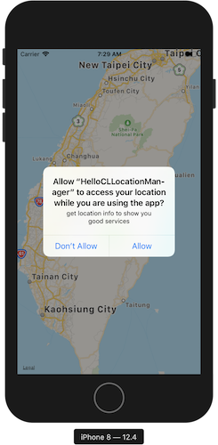

# 2019.07.05
## Udemy 深入淺出iPhone開發（使用swift 4）
---
### 第一節 你的第一款應用程式：Hello swift
* 申請成為開發者
* 熟悉、使用xcode
* 了解button連結 (action)
* 了解label連結 (outlet)
* `viewDidLoad()` 是在畫面剛讀入時執行
* `didReceiveMemoryWarning()` 是在記憶體不夠時執行
* 連結元件到程式碼是按住control鍵拖曳
---
### 第二節 swift語言快速上手：基礎型別
* playground
* 變數宣告 ``var a = 5``
* 常數宣告 ``let b = 2.5``
* 變數/常數+型別 
    ```swift
    var age:Int = 4
    var weight:Float = 66.6
    let pi:Double = 3.14
    ```
* 浮點數
    ```swift
    age / weight 
    //錯誤，整數不能直接除小數
    Float(age) / weight
    //須先轉型成Float，再做除法
    5/2 
    // 2，整數除整數會無條件捨去到整數位
    Double(5)/2 
    // 2.5，若要得到正確答案，須先轉型
    ```
* 布林值``var isLocked:Bool = true``

* 字串
    ```swift
    var language:String = "swift"
    let hello:String = "Hello"

    hello + " " + language
    //output: "hello swift"，連結字串用加號
    var str = "my language is \(language)"
    //output: "my language is swift"，也可以用\(變數)來加入字串
    "my language is \"swift\""
    //output: "my language is "swift""，若字串中有雙引號，要在雙引號前放上跳脫字元\

    var str = "aAbBCc"
    str.lowercased() //output: "aabbcc"
    str.uppercased() //output: "AABBCC"

    var str = """
    a b c
    d e f
    g h i
    """
    //output: "a b c\nd e f\ng h i"，多行字串用"""包起來
    ```
---
### 第三節 集合型別
* 陣列 
    ```swift
    //索引值從0開始
    var array:[String] = ["A","b","c","D","EF"]
    //索引值       0   1   2   3   4
    array[0] //output: "A"
    array[3] //output: "D"
    array[5] //錯誤，沒有5號元素

    array.count //output: 5，計算陣列有多少成員

    array.append("ghi") //array: ["A", "b", "c", "D", "EF", "ghi"]
    // array.append():在陣列後面加入新成員

    array.insert("new", at: 3) 
    // array: ["A", "b", "c","new", "D", "EF", "ghi"]
    // array.insert():在指定位址插入新成員

    array.remove(at: 2)
    // array: ["A", "b", "new", "D", "EF", "ghi"]
    // array.remove():刪除指定位置的成員

    array.removeLast()
    // array: ["A", "b", "new", "D", "EF"]
    // array.removeLast():刪除最後一個元素

    array.removeFirst()
    // array: ["b", "new", "D", "EF"]
    // array.removeFirst():刪除第一個元素

    array.append(1)
    //錯誤，array只能存放同一型別的成員

    array.reverse()
    // array: ["EF", "D", "new", "b"]
    // array.reverse():將array反轉

    var array2:[String] = ["1","2","3"]

    array = array + array2
    // array: ["EF", "D", "new", "b", "1", "2", "3"]
    // array加法：把兩個陣列連起來

    //建立空陣列的方法
    var array:[Int] = []
    var array2 = [Int]()
    ```
* 字典
    ```swift
    var e2c:[String:String] = ["one":"一","two":"二","three":"三"]
    // 鍵值對格式：key:value，每組鍵值對間用逗號隔開
    e2c["one"]   // output: "一"
    e2c["three"] // output: "三"
    e2c["two"]   // output: "二"
    e2c["ten"]   // output: nil
    // 用不存在的key取值會得到nil

    // 更新value的方法
    e2c["one"] = "壹"
    // e2c: ["one": "壹", "two": "二", "three": "三"]
    e2c.updateValue("一", forKey: "one")
    // e2c: ["one": "一", "two": "二", "three": "三"]

    // 加入新的鍵值對
    e2c["four"] = "四"
    e2c.updateValue("五", forKey: "five")
    // e2c: ["one": "一", "three": "三", "four": "四", "five": "五", "two": "二"]

    // 刪除鍵值對
    e2c["five"] = nil; // nil代表空
    e2c.removeValue(forKey: "four")
    // e2c: ["one": "一", "two": "二", "three": "三"]
    ```
---
### 第四節 流程控制：做出第二款解鎖大師遊戲APP

* if判斷式
    ```swift
    var price = 80;

    if price < 70{
        print("Very cheap")
    } else if price > 130{
        print("Are you crazy?")
    } else {
        print("buy it")
    } 

    // && : 且， || : 或
    ```
* switch
    ```swift
    var price = 80
    switch price {
    case 20...40:
        print("cheap")
    case 70,80,90:
        print("ok")
    case 200:
        print("expensive")
    default:
        print("???")
    }
    // default不可省略
    // 20...40 是指20到40都會進入這個case
    // 70,80,90 是指70,80,90這三個會進入這個case
    ```
* 解鎖大師遊戲APP
    ```swift
    // 取亂數
    import GameKit
    var answer:Int = GKRandomSource.sharedRandom().nextInt(upperBound: 100)+1

    // 修改StatusBarStyle
    override var preferredStatusBarStyle: UIStatusBarStyle{
        return .lightContent
    }

    // 修改背景圖
    @IBOutlet weak var background: UIImageView!
    background.image = UIImage(named: "Finish")

    // 修改messageLabel.text
    messageLabel.text = "Guess a number between \(min) to \(max)"
    ```


---
# 2019.07.19
### 第五節 重複做事情的好幫手：迴圈
* for loop
    ```swift
    // 格式
    for 自己設定的名字 in 陣列的名字{
        // 要執行的程式碼
    }
    let array:[Int] = [1,2,3,4,5]
    for i in array{
        print(i)
    }
    // output: "1\n2\n3\n4\n5\n"

    var array2:[Int] = []
    for i in array{
        array2.append(i+2)
    }
    // array2: [3, 4, 5, 6, 7]

    let strArr:[String] = ["Acs","CcC","ewf","cAc"]
    var strArr2:[String] = []
    for str in strArr{
        strArr2.append(str.lowercased())
    }
    // output: ["acs", "ccc", "ewf", "cac"]

    // 全閉範圍區間 1...5 指的是 (1,2,3,4,5)
    // 半壁範圍區間 1..<5 指的是 (1,2,3,4)
    for index in 1...100{
        print(index)
    }
    // 從1印到100

    // 若for 中用不到index 可將index改為_
    for _ in 1...3{
        print("HI")
    }
    // 迴圈做3次

    // 九九乘法表
    for num1 in 1..<10{
        for num2 in 1..<10{
            print("\(num1) * \(num2) = \(num1*num2)")
        }
    }

    for index in 1...10 where index%2 == 1{
        print(index)
    }
    // output: "1\n3\n5\n7\n9\n"

    // for + dictionary
    let e2c:[String:String] = ["one":"一","two":"二","three":"三"]
    for (key,value) in e2c{
        print("\(key):\(value)")
    }
    // output: "three:三\ntwo:二\none:一\n"
    ```
* tuple 元組，把很多資料用小括號包起來
    ```swift
    // (key,value) : 稱為元組(tuple)，把很多資料用小括號包起來

    let colors = ("red","orange","yellow","green")
    // 元組用 colors.0 的方式存取

    // tuple 中可存不同型別
    let tuple = ("a",12,true,3.14,[1,2,3])
    let e2c = (one:"一",two:"二",three:"三")
    e2c.one // output: "一"
    e2c.0   // output: "一"
    ```
* while loop
    ```swift
    var index = 1
    while index <= 10 {
        print(index)
        index += 1
    }

    // while + array
    let array:[Int] = [1,2,3,4,5]
    var index = 0
    while index < array.count{
        print(array[index])
        index += 1
    }

    // repeat-while
    repeat{
        print("just do it \(index) times.")
        index += 1
    }while index < 11
    // 從1印到10
    // repeat-while 即使條件不符合，最少會執行一次，類似其他的do-while
    ```
---
### 第六節 函式：呼叫我！使命必達！
* DRY:Don't Repeat Youself : 避免使用重複程式碼
* function
    ```swift
    // 定義函式 : 函式還不會執行
    func functionName(parameter){
        // 會需要重複做的事情
    }
    // 呼叫函式 ： 函式執行
    functionName(parameter)

    func eat(foodName:String){
        print("eat "+foodName)
    }
    eat(foodName: "hamburger")
    // output: eat hamburger
    eat(foodName: "pizza")
    // output: eat pizza

    // 有回傳值的函式
    func add(num1:Int,num2:Int) -> Int{
        return num1 + num2
    }
    let ans = add(num1: 2, num2: 6)

    // 沒有回傳值的寫法
    func functionName(parameter){
    }
    func functionName(parameter) -> Void{
    }
    func functionName(parameter) -> (){
    }

    // 外部參數名： withWidth、andHeight
    // 內部參數名： width、height
    func calculateArea(withWidth width:Float, andHeight height:Float) -> Float{
        return width * height
    }
    calculateArea(withWidth: 12.3, andHeight: 45.6)

    // 省略外部參數名
    func buy(_ thing:String){
        print("buy "+thing)
    }
    buy("macbook")
    ```
* 變數可視範圍
    * 大括號裡面看得到外面
        ```swift
        var a:Int = 10
        if true{
            print(a)
        }
        // output: 10
        ```
    * 大括號外面看不到裡面
        ```swift

        if true{
            let i = 12
        }
        print(i)
        // output: 5
        ```
    * 大括號創造了新的命名空間
        ```swift
        let i = 5
        if true{
            let i = 12
        }
        print(i)
        // output: 5
        ```
---
### 第七節 閉包：請先想成這是沒有名字的函式
* closure(閉包)
* 沒有外部參數名
    ```swift
    let helloClosure = {
        print("hello")
    }
    helloClosure()

    let add = {
        (num1:Int,num2:Int) -> Int in
        return num1 + num2
    }
    add(3,5)
    // closure也有型別
    // helloClosure 的型別是()->()
    // add 的型別是(Int,Int)->Int
    ```
* 可當作變數傳入函式
    ```swift
    func calculate(num1:Int,num2:Int,operation:(Int,Int)->Int){
        print(operation(num1,num2))
    }
    let add = {
        (num1:Int,num2:Int) -> Int in
        return num1 + num2
    }
    calculate(num1: 3, num2: 4, operation: add)
    ```
* 簡寫closure
    1. 已經能夠確認參數與回傳值得型別的話，可以刪除，可以刪除Closure裡面參數跟回傳值得型別
        ```swift
        // before
        let add = {
        (num1:Int,num2:Int) -> Int in
        return num1 + num2
        }
        // after
        let add:(Int,Int)->Int = {
            (num1,num2) in
            return num1 + num2
        }
        ```
    2. 程式碼只有一行的情況下可以刪除``return``
        ```swift
        // before
        let add:(Int,Int)->Int = {
            (num1,num2) in
            return num1 + num2
        }
        // after
        let add:(Int,Int)->Int = {
            (num1,num2) in num1 + num2
        }
        ```
    3. 用``$0``,``$1``,``$2``...代替傳進來的參數名稱
        ```swift
        // before
        let add:(Int,Int)->Int = {
            (num1,num2) in num1 + num2
        }
        // after
        let add:(Int,Int)->Int = { $0 + $1 }
        ```
    4. 如果是最後或是唯一個參數，可把closure放在參數小括號外
        ```swift
        // before
        let numberArrayAddTen = numberArray.map({ $0+10 })
        // after
        let numberArrayAddTen = numberArray.map(){ $0+10 }
        ```
    5. 如果是唯一個參數，可省略參數小括號
        ```swift
        // before
        let numberArrayAddTen = numberArray.map(){ $0+10 }
        // after
        let numberArrayAddTen = numberArray.map{ $0+10 }
        ```
* 陣列的 map() 方法：把陣列的每個成員拿出來做一些事情
    ```swift
    var numberArray=[1,3,5,7,9,2,4,6,8,10]
    let numberArrayAddTen = numberArray.map {$0 + 10}
    }
    // output: [11,13,15,17,19,12,14,16,18,20]
    ```
* 陣列的 filter() 方法：過濾功能
    ```swift
    var numberArray=[1,3,5,7,9,2,4,6,8,10]
    let numberArrayEven = numberArray.filter {$0 % 2 == 0}
    // output: [2, 4, 6, 8, 10]
    ```
---
### 第八節 optional 與質數判斷APP
* optional型別 (非必需的)
    ```swift
    var i:Int = 10
    // i的型別是Int，儲存10
    var j:Int = nil
    // error: j的型別是Int，無法儲存nil
    var k:Int? = nil
    // 為了儲存nil和Int，必須使用optional Int型別(Int?)
    var isLightOn:Bool? = nil; 
    // 為了儲存nil和Bool，必須使用optional Bool型別(Int?)

    var x:Int?
    // x預設為nil

    var y:Int? = 8;
    print(y)
    // output: optional(8)

    y+2
    // error: optional Int 和 Int無法相加

    var z:Int!;
    // 除了用Int?表示optional外，也可用Int!表示
    // 用Int!在程式中，都不會檢查值是否為nil，類似其他語言
    ```
* 處理optional的方法
    1. 強迫解開包裝 force unwarpping 
        ```swift
        // 在變數後加上!可以強迫解開包裝
        var x:Int? = 8
        x! + 2
        // output: 10

        var y:Int? = nil
        y! + 2
        // error
        ```
    2. 先判斷是否有值，再做後續的處理
        ```swift
        var x:Int? = 8;
        if x != nil{
            x! + 2
            // output: 10
            x = x! + 2
            // x: optional(10)
        }
        ```
    3. optional binding:最好的處理方式
        ```swift
        var x:Int? = 8;
        if let myNumber = x{
            myNumber + 2
        }

        ```
* TernaryConditionl operator(三元運算子)
    ```swift
    var x:Int? = 3
    var y:Int
    y = x != nil ? x! : 0
    //等價於下面
    if x != nil{
        y = x!
    } else {
        y = 0
    }
    ```
* Nil-Coalesing operator(空值聚合運算子)
    ```swift
    var x:Int? = 3
    var y:Int
    y = x ?? 0
    //等價於下面
    if x != nil{
        y = x!
    } else {
        y = 0
    }
    ```
* 質數判斷APP
* playground練習
    ```swift
    let inputNumber:Int = 18
    var isPrime:Bool? = true

    if inputNumber <= 0 {
        isPrime = nil
    } else if inputNumber == 1{
        isPrime = true
    } else {
        for i in 2..<inputNumber{
            if(inputNumber % i == 0) {
                isPrime = false
            }
        }
    }

    if isPrime == true {
        print("\(inputNumber) is prime")
    } else if isPrime == false{
        print("\(inputNumber) isn't prime")
    } else {
        print("reenter")
    }

    // 函數寫法
    func checkPrime(withNumber testNumber:Int) -> String{
        var isPrime:Bool? = true
        
        if testNumber <= 0 {
            isPrime = nil
        } else if testNumber == 1{
            isPrime = true
        } else {
            for i in 2..<testNumber{
                if(testNumber % i == 0) {
                    isPrime = false
                }
            }
        }
        
        
        if isPrime == true {
            return "\(testNumber) is prime"
        } else if isPrime == false{
            return "\(testNumber) isn't prime"
        } else {
            return "reenter"
        }
    }
    print(checkPrime(withNumber: inputNumber))
    ```
* ``@IBaction`` interface builder Action
* push the keyboard on :``inputTextField.becomeFirstResponder()``
* viewController.swift
    ```swift
    import UIKit

    class ViewController: UIViewController {
        
        @IBOutlet weak var inputTextField: UITextField!
        
        @IBOutlet weak var resultLabel: UILabel!
        
        override var preferredStatusBarStyle: UIStatusBarStyle{
            return .lightContent
        }
        
        @IBAction func doThePrimeTest(_ sender: UIButton) {
            // 1.把文字輸入框的文字拿出
            if let inputText = inputTextField.text, let inputNumber = Int(inputText){
                // 3.用checkPrime()得到輸出的字串
                // 4.用resultLabel顯示結果
                checkPrime(withNumber: inputNumber){
                    self.resultLabel.text = $0
                    self.resultLabel.isHidden = false
                }
            }
            inputTextField.text = ""
        }
        
        
        override func viewDidLoad() {
            super.viewDidLoad()
            // Do any additional setup after loading the view.
            // push the keyboard on
            inputTextField.becomeFirstResponder()
        }
        
        func checkPrime(withNumber testNumber:Int) -> String{
            var isPrime:Bool? = true
            
            if testNumber <= 0 {
                isPrime = nil
            } else if testNumber == 1{
                isPrime = true
            } else {
                for i in 2..<testNumber{
                    if(testNumber % i == 0) {
                        isPrime = false
                        break
                    }
                }
            }
            
            
            if isPrime == true {
                return "\(testNumber) is prime"
            } else if isPrime == false{
                return "\(testNumber) isn't prime"
            } else {
                return "reenter"
            }
        }
        
        
        func checkPrime(withNumber number:Int,andCompletionHandler handler: (String)->()){
            handler(checkPrime(withNumber: number))
        }
        
    }

    ```
* 作品截圖

---
### 第九節 物件導向程式設計(上)
* OOP : object-oriented programming
    ```swift
    // Lego類別，可想成是製造物件的藍圖
    // 類別名稱第1個字通常用大寫
    class Lego{
        // 物件有的屬性(property)，描述物件的特性
        var color = "blue"
        var size = 8;

        // 物件的方法，描述物件會做的事
        func connect() {
            print("connect with another block")
        }
        func remove() {
            print("disconnect with another block")
        }
    }

    let oneBlock = Lego()
    // Lego() : 建立樂高物件

    oneBlock.color
    oneBlock.size
    // 存取oneBlock這塊樂高的屬性

    class Baby {
        var name:String = "Tom"
        var age:Int = 1
        
        func sleep(){
            print("sleep")
        }
        
        func introduceSelf(){
            print("My name is \(name)")
        }
    }

    let baby1 = Baby()
    let baby2 = Baby()
    baby2.name = "Nancy"

    baby1.introduceSelf()
    // output: My name is Tom
    baby2.introduceSelf()
    // output: My name is Nancy

    // 每個不同的物件是相互獨立的
    ```
* 初始化
    ```swift
        class Baby {
        var name:String
        var age:Int
        
        init(){
            // 要先初始化屬性，才能呼叫方法
            name = "Tom"
            age = 1
            introduceSelf()
        }
        init(name:String){
            self.name = name
            age = 2;
            introduceSelf()
        }
        init(age:Int){
            name = "Sophie"
            self.age = age
            introduceSelf()
        }
        init(name:String, age:Int) {
            self.name = name
            self.age = age
            introduceSelf()
        }
        
        func sleep(){
            print("sleep")
        }
        func introduceSelf(){
            print("My name is \(name).I am \(age) years old")
        }
    }

    let baby1 = Baby()
    let baby2 = Baby(name: "Ian")
    let baby3 = Baby(age: 3)
    let baby4 = Baby(name: "Eric", age: 2)
    // output:
    // My name is Tom.I am 1 years old
    // My name is Ian.I am 2 years old
    // My name is Sophie.I am 3 years old
    // My name is Eric.I am 2 years old
    ```
* 子類別 Subclass : 繼承別的類別的屬性與方法
    ```swift
    class Baby {
        var name:String
        var age:Int
        
        init(){
            // 要先初始化屬性，才能呼叫方法
            name = "Tom"
            age = 1
            introduceSelf()
        }
        init(name:String){
            self.name = name
            age = 2;
            introduceSelf()
        }
        init(age:Int){
            name = "Sophie"
            self.age = age
            introduceSelf()
        }
        init(name:String, age:Int) {
            self.name = name
            self.age = age
            introduceSelf()
        }
        
        func sleep(){
            print("sleep")
        }
        func introduceSelf(){
            print("My name is \(name).I am \(age) years old")
        }
    }
    // CuteBaby 繼承 Baby
    class CuteBaby:Baby{
        var nickname:String
        func danceAndSing(){
            print("Dance and sing.")
        }
        // 覆寫 Baby 的 sleep() 
        override func sleep() {
            print("sleep with cute smile")
            super.sleep()
        }
        // 覆寫 Baby 的 introduceSelf()
        override func introduceSelf() {
            print("My name ia \(nickname)")
        }
        // 覆寫 init() 順序
        // 1. 初始化子類別屬性
        // 2. super.init()
        // 3. 設定父類別屬性
        override init() {
            nickname = "QQ"
            super.init()
            name = "Sunny"
        }
    }

    let iAmSoQ = CuteBaby()
    iAmSoQ.name
    iAmSoQ.nickname
    iAmSoQ.sleep()
    // output: 
    // My name ia QQ
    // sleep with cute smile
    // sleep
    ```
---
### 第十節 UIView 與記憶體管理
* ``deinit()``釋放記憶體
    ```swift
    class Person{
        var firstName = "Ian"
        var lastName = "Lu"
        var fullName:String
        init() {
            fullName = firstName+lastName;
            print("A person is being initialized")
        }
        deinit {
            print("A person is being deinitialized")
        }
    }
    var person1:Person? = Person();
    // 小括號的完整意義
    // 1. 啟動一塊記憶體
    // 2. 然後執行init()方法

    person1?.fullName

    // 當person實體不在被人需要會執行deinit()方法，回收記憶體
    // person1 = nil

    // person1 和 person2 參考同一段記憶體
    var person2:Person? = person1
    person1?.firstName = "Wei"
    // person1?.firstName : "Wei"
    // person2?.firstName : "Wei"

    var number1 = 1
    var number2 = number1
    number1 = 10
    // number1 : 10
    // number2 : 1

    person2 = nil
    // 現在還有person1 參考這段記憶體，所以不會執行deinit()方法
    person1 = nil
    // 當person1不在參考這段記憶體，就沒有其他變數會參考這段記憶體了，所以此時會執行deinit()方法，回收記憶體
    ```
* retain cycle 循環參考
    ```swift
    class Person{
        var heart:Heart?
        init() {
            print("A person is being initialized")
        }
        deinit {
            print("A person is being deinitialized")
        }
    }
    class Heart{
        var person:Person?
        init() {
            print("A heart is being initialized")
        }
        deinit {
            print("A heart is being deinitialized")
        }
    }

    var aPerson:Person? = Person()
    var aHeart:Heart? = Heart()
    //-------------
    aPerson = nil
    aHeart = nil
    //output:
    //A person is being initialized
    //A heart is being initialized
    //A person is being deinitialized
    //A heart is being deinitialized
    //-------------

    //------------retain cycle
    aPerson?.heart = aHeart
    aHeart?.person = aPerson

    aPerson = nil
    // 由於aHeart.person仍在使用所以不會釋放
    aHeart = nil
    // output:
    //A person is being initialized
    //A heart is being initialized
    //-------------
    ```
* 解決方法：weak弱參考
    ```swift
    class Person{
        weak var heart:Heart?
        init() {
            print("A person is being initialized")
        }
        deinit {
            print("A person is being deinitialized")
        }
    }
    class Heart{
        weak var person:Person?
        init() {
            print("A heart is being initialized")
        }
        deinit {
            print("A heart is being deinitialized")
        }
    }

    var aPerson:Person? = Person()
    var aHeart:Heart? = Heart()

    aPerson?.heart = aHeart
    aHeart?.person = aPerson

    aPerson = nil
    aHeart = nil
    // output:
    //A person is being initialized
    //A heart is being initialized
    //A person is being deinitialized
    //A heart is being deinitialized
    ```
* UIView
    * 屬性與方法
        * ``backgroundColor``
        * ``alpha``
        * ``isHidden``
        * ``addSubView()``
    * 範例
        ```swift
        class ViewController: UIViewController {

            @IBOutlet weak var midRect: UIView!
            override func viewDidLoad() {
                super.viewDidLoad()
                // Do any additional setup after loading the view.
                // 調整背景色
                midRect.backgroundColor = UIColor.green
                // 調整透明度
                midRect.alpha = 0.5
                // 隱藏midRect
                // midRect.isHidden = true
                
                
                // optional chaining
                // view.viewWithTag(101)?.backgroundColor = UIColor.lightGray
                
                // 自己加入UIView
                let viewArea = CGRect(x: 50, y: 400, width: 100, height: 50)
                let smallRect = UIView(frame: viewArea)
                smallRect.backgroundColor = UIColor.purple
                // 將自己做的UIView加入self.view的subView
                // view.addSubview(smallRect)
                // 不一定要加入self.view的subView，也可以加入其他UIView的subView，如下
                view.viewWithTag(101)?.addSubview(smallRect)
            }
        }
        ```
---
### 第十一節 認識基礎UI元件與自動排版
* UISwitch
    ```swift
    class ViewController: UIViewController {
        @IBOutlet weak var mySwitch: UISwitch!
        
        @IBAction func makeAChange(_ sender: UISwitch) {
            if sender.isOn==true{
                print("isON")
                view.backgroundColor = .white
            } else {
                print("isOFF")
                view.backgroundColor = .black
            }
        }
        
        @objc func codeSwitchChanged(_ sender: UISwitch) {
            if sender.isOn==true{
                print("isON")
                view.backgroundColor = .white
            } else {
                print("isOFF")
                view.backgroundColor = .black
            }
            
        }
        override func viewDidLoad() {
            super.viewDidLoad()
            mySwitch.isOn = false
            makeAChange(mySwitch)
            
            // generate a UISwitch using code
            let callSwitch = UISwitch(frame: CGRect(x: view.frame.midX-51/2, y: view.frame.maxY-100, width: 51, height: 31))
            view.addSubview(callSwitch)
            
            callSwitch.isOn = true;
            callSwitch.addTarget(self, action: #selector(ViewController.codeSwitchChanged(_:)), for: .valueChanged)
        }
    }
    ```
* UISegmentedControl
    ```swift
    class ViewController: UIViewController {
        @IBAction func colorToggleChanged(_ sender: UISegmentedControl) {
            if sender.selectedSegmentIndex == 0{
                view.backgroundColor = .white
            } else if sender.selectedSegmentIndex == 1{
                view.backgroundColor = .black
            } else if sender.selectedSegmentIndex == 2{
                view.backgroundColor = .red
            } else if sender.selectedSegmentIndex == 3{
                view.backgroundColor = .orange
            } else if sender.selectedSegmentIndex == 4{
                view.backgroundColor = .yellow
            } else {
                
            }
            
        }
        
        @IBAction func myToggleChanged(_ sender: UISegmentedControl) {
            
            if sender.selectedSegmentIndex == 0{
                print("public")
            } else if sender.selectedSegmentIndex == 1{
                print("private")
            }
        }
        override func viewDidLoad() {
            super.viewDidLoad()
            // Do any additional setup after loading the view.
        }
    }

    ```
* UISlider
    ```swift
    class ViewController: UIViewController {

        @IBOutlet weak var myLabel: UILabel!
        
        @IBAction func sliderChanged(_ sender: UISlider) {
            myLabel.text = "\(Int(sender.value))"
        }
        
        override func viewDidLoad() {
            super.viewDidLoad()
            // Do any additional setup after loading the view.
        }
    }
    ```
* auto layout 自動排版
    * 因iPhone各版本大小不同如果用iPhone開發，用iPad開啟，就會發生跑版
    * auto layout要設定以下屬性x,y,width,height
    * 以UIswiych置中為例，要點選元件後按右下角align，選擇Horizontally in Container 和 Vertically in Container 在選取 Add Containers，這樣就完成 x,y 的調整，接下來點選右下角的Add New Constraints設定width,height，就完成了
    * 依照比例設定方法：
        1. 先設定等寬
        2. 再設定比例
* APP:color finder
    * ViewController.swift
    ```swift
    class ViewController: UIViewController {
        var redValue = 255
        var greenValue = 255
        var blueValue = 255
        @IBOutlet weak var redText: UILabel!
        @IBOutlet weak var greenText: UILabel!
        @IBOutlet weak var blueText: UILabel!
        
        @IBAction func redSliderChanged(_ sender: UISlider) {
            redValue = Int(sender.value)
            redText.text = "R: \(redValue)"
            changeBackgroundColor()
        }
        
        @IBAction func greenSliderChanged(_ sender: UISlider) {
            greenValue = Int(sender.value)
            greenText.text = "G: \(greenValue)"
            changeBackgroundColor()
        }
        @IBAction func blueSliderChanged(_ sender: UISlider) {
            blueValue = Int(sender.value)
            blueText.text = "B: \(blueValue)"
            changeBackgroundColor()
        }
        
        func changeBackgroundColor() {
            view.backgroundColor = UIColor(red: CGFloat(redValue)/255, green: CGFloat(greenValue)/255, blue: CGFloat(blueValue)/255, alpha: 1)
        }
        
        override func viewDidLoad() {
            super.viewDidLoad()
            // Do any additional setup after loading the view.
        }
    }
    ```
    * layout
        * 透過黃色UIView和紫色UIView協助label和slider的定位，再搭配auto layout設定x,y,width,height使得在各個畫面都能呈現想要的版型
    
    
    
    

* 作品截圖

    
    
---
# 2019.08.02
### 第十二節 更多UI元件介紹
* UIAlertController
    * title
    * message
    * UIAlertAction
    * code
        ```swift
        @IBAction func showAlert(_ sender: UIButton) {
            let myAlert = UIAlertController(title: "Hello", message: "How are you", preferredStyle: .alert)
            
            let okAction = UIAlertAction(title: "OK", style: .default) {
                (action:UIAlertAction) in
                // 關閉畫面
                self.dismiss(animated: true, completion: nil)
            }
            // 如果只要self.dismiss()可以簡寫如下
            // let okAction = UIAlertAction(title: "OK", style: .default)
            
            let helloAction = UIAlertAction(title: "Say Hello", style: .destructive) {
                (action:UIAlertAction) in
                print("Hello")
                self.dismiss(animated: true, completion: nil)
            }
            let cancelAction = UIAlertAction(title: "cancel", style: .cancel) {
                (action:UIAlertAction) in
                print("cancel")
                self.dismiss(animated: true, completion: nil)
            }
            
            // 將按鈕加入UIAlertController
            myAlert.addAction(okAction)
            myAlert.addAction(helloAction)
            myAlert.addAction(cancelAction)

            // 彈出UIAlertController
            present(myAlert, animated: true, completion: nil)
        }
        ```
* UIImage
    * UIImage 不是圖片，可以想成是相框
    * UIImage 才是圖片
    * view > content mode
        * scale to fill : 不等比例放大填滿整個畫面
        * aspect fit : 等比例放大，有一邊再放大就超過畫面即停止放大
        * aspect fill : 等比例放大，有兩邊再放大就超過畫面即停止放大
    * 用程式碼換圖
        ```swift
		myPet.image = UIImage(named: "MyDog")
        ```
* UIButton
    * 更換自己的圖
        1. state config > default
        2. image > 選擇一般狀態的按鈕圖
        3. state config > highlightd
        4. image > 選擇按下狀態的按鈕圖
    * 用程式碼產生按鈕
        ```swift
        // 做一個system style 的 UIButton
		let newButton = UIButton(type: .system)
		// 設定按鈕的 x,y,width,height
		newButton.frame = CGRect(x: 50, y: 50, width: 100, height: 50)
		// 設定按鈕各個狀態的文字
		newButton.setTitle("Press", for: .normal)
		newButton.setTitle("Pressing", for: .highlighted)
		// 將按鈕加到view
		view.addSubview(newButton)
		// 新增按鈕的事件
		newButton.addTarget(self, action: #selector(ViewController.hitMe(_:)), for: .touchUpInside)
		
		// 做一個image button
		let anotherButton = UIButton(type: .custom)
		anotherButton.frame = CGRect(x: 200, y: 200, width: 144, height: 54)
		// 設定按鈕各個狀態的圖片
		anotherButton.setImage(UIImage(named: "PlayButton"), for: .normal)
		anotherButton.setImage(UIImage(named: "PlayButtonPressed"), for: .highlighted)
		view.addSubview(anotherButton)
		anotherButton.addTarget(self, action: #selector(ViewController.hitMe(_:)), for: .touchUpInside)
        ```
    * 用 closure 生 button
        ```swift
        // 好處：縮短 viewDidLoad() 的程式

        let codeButton:UIButton = {
            // 做一個system style 的 UIButton
            let newButton = UIButton(type: .system)
            // 設定按鈕的 x,y,width,height
            newButton.frame = CGRect(x: 300, y: 50, width: 100, height: 50)
            // 設定按鈕各個狀態的文字
            newButton.setTitle("A", for: .normal)
            newButton.setTitle("B", for: .highlighted)
            // 新增按鈕的事件
            newButton.addTarget(self, action: #selector(ViewController.hitMe(_:)), for: .touchUpInside)
            return newButton
	    }()
        override func viewDidLoad() {
            super.viewDidLoad()
            view.addSubview(codeButton)
        }
        ```
* APP : 小小算命師
    * auto layout
        * OldMan:`UIImageView`
            * x : Horizontally in Container
            * y : Vertically in Container
            * height : equal to superview
            * width : Aspect Ratio
        * helpView:`UIView`
            * x : align leading to safe area
            * y : align bottom to superview
            * height : proportional superview 240:1024
            * width : 240
        * yourFortune:`UIImageView`
            * x : Horizontally in Container
            * y : bottom space to helpView
            * height : proportional superview 228:1024
            * width : Aspect Ratio
        * viewForButton:`UIView`
            * x : align trailing to safe area
            * y : align bottom to superview
            * height : proportional superview 85:1024
            * width : 240
        * Button:`UIButton`
            * x : Horizontally in Container
            * y : bottom space to viewForButton -8
            * height : proportional superview 85:1024
            * width : Aspect Ratio
    * code
        ```swift
        import UIKit
        import GameKit
        import AudioToolbox

        class ViewController: UIViewController {

            override var prefersStatusBarHidden: Bool{
                return true
            }
            @IBOutlet weak var yourFortune: UIImageView!
            @IBAction func tellMeSomething(_ sender: UIButton) {
                if yourFortune.isHidden == true {
                    showAnswer()
                } else {
                    // 隱藏圖片
                    yourFortune.isHidden = true;
                }
            }
            
            override func motionEnded(_ motion: UIEvent.EventSubtype, with event: UIEvent?) {
                // 如果搖晃手機執行
                if event?.subtype == .motionShake {
                    showAnswer()
                }
            }
            
            func showAnswer() {
                // 做一個1到6的亂數
                let answer = GKRandomSource.sharedRandom().nextInt(upperBound: 6)+1
                // 換圖
                yourFortune.image = UIImage(named: "\(answer)")
                yourFortune.isHidden = false
                // 播放音效
                AudioServicesPlaySystemSound(1000)
            }
            
            override func viewDidLoad() {
                super.viewDidLoad()
                // Do any additional setup after loading the view.
            }
        }
        ```
    * 成品
    
    
### 第十三節 協定
* UIPickerView
    1. 在`main.storyboard`連結`PickerView`的`datasource`和`delegate`到`ViewController`
    2. `ViewController.swift`加入以下協定`UIPickerViewDataSource`和`UIPickerViewDelegate`
    3. 設定有幾個component
    4. 設定有每個component有幾個row
    5. 設定每個欄位的title
    6. 設定選擇這個component這個row要做的事情
    ```swift
    class ViewController: UIViewController,UIPickerViewDataSource,UIPickerViewDelegate {
        let numberArray = ["1","2","3","4","5","7","8"]
        let fruitArray = ["apple","banana","mango","watermalon"]
        
        // 設定有幾個component
        func numberOfComponents(in pickerView: UIPickerView) -> Int {
            // how many component in picker view
            return 2
        }
        
        // 設定有每個component有幾個row
        func pickerView(_ pickerView: UIPickerView, numberOfRowsInComponent component: Int) -> Int {
            if component == 0 {
                return numberArray.count
            } else {
                return fruitArray.count
            }
        }
        
        // 設定每個欄位的title
        func pickerView(_ pickerView: UIPickerView, titleForRow row: Int, forComponent component: Int) -> String? {
            if component == 0 {
                return numberArray[row]
            } else {
                return fruitArray[row]
            }
        }
        
        // 設定選擇這個component這個row要做的事情
        func pickerView(_ pickerView: UIPickerView, didSelectRow row: Int, inComponent component: Int) {
            if component == 0{
                print("number: \(numberArray[row])")
            } else {
                print("fruit: \(fruitArray[row])")
            }
        }
        
        override func viewDidLoad() {
            super.viewDidLoad()
            // Do any additional setup after loading the view.
        }
    }
    ```
* 協定 portocol
    * 服從協定要實作協定中的方法
    ```swift
    protocol SoyMilkGetable {
        func giveMeSoyMilk()
    }

    class Brunch:SoyMilkGetable{
        func giveMeSoyMilk() {
            print("Soy Milk")
        }
        
        
    }

    let aBrunch = Brunch()
    aBrunch.giveMeSoyMilk()

    protocol MoneyTransferProtocol {
        func giveMoney()
    }

    class RichPeople:MoneyTransferProtocol{
        func giveMoney() {
            print("Give you 100 dollars")
        }
    }
    class PoorGuy {
        var helper:MoneyTransferProtocol?
        func needMoney(){
            helper?.giveMoney()
        }
    }

    class NormalPeople:MoneyTransferProtocol{
        func giveMoney() {
            print("Give you 10 dollars")
        }
    }

    let aPoorGuy = PoorGuy()
    let aRichPeople = RichPeople()
    let aNormalPeople = NormalPeople()
    aPoorGuy.helper = aNormalPeople
    aPoorGuy.needMoney()
    ```
    * 上述PickerView運作邏輯類似於下
    ```swift
    protocol PickerViewDataSource{
        func howManyComponent()
        func howManyRow()
        
    }

    protocol PickerViewDelegate {
        func titleToShow()
        func didSelect()
    }
    class ViewController:PickerViewDataSource,PickerViewDelegate{
        func howManyComponent() {
            print("2")
        }
        func howManyRow() {
            print("10")
        }
        
        func titleToShow() {
            print("Hello")
        }
        func didSelect() {
            print("Select")
        }
    }

    class PickerView {
        var dataSource:PickerViewDataSource?
        var delegate:PickerViewDelegate?
        
        func howManyComponentIhave() {
            dataSource?.howManyComponent()
        }
        func howManyRowIhave() {
            dataSource?.howManyRow()
        }
        
        func whatToShow() {
            delegate?.titleToShow()
        }
        func afterSelect() {
            delegate?.didSelect()
        }
    }
    let aPickerView = PickerView()
    let aViewController = ViewController()
    aPickerView.dataSource = aViewController
    aPickerView.delegate = aViewController

    aPickerView.howManyComponentIhave()
    aPickerView.howManyRowIhave()

    aPickerView.whatToShow()
    aPickerView.afterSelect()
    ```
* protocol oriented programming
    * 優點
        1. 可以服從多個協定
        2. 保證一定會實作
        3. 某幾個子類別有相同的方法
    * protocol vs object
    ```swift
    // protocol oriented programming
    protocol ManKindType{
        var health:Int{ get set }
    }
    protocol Attackable {
        func attack(target:Hurtable)
    }
    protocol Hurtable:ManKindType {
        func getHurt()
    }
    class Man:ManKindType,Hurtable{
        var health:Int
        init(){
            health = 10
        }
        func getHurt() {
            health -= 10
        }
    }
    class BatMan:ManKindType,Hurtable,Attackable{
        var health: Int
        init(){
            health = 1000
        }
        func getHurt() {
            health -= 5
        }
        func attack(target:Hurtable) {
            print("attack with fist")
            target.getHurt()
        }
    }
    class SuperMan:ManKindType,Hurtable,Attackable{
        var health: Int
        init() {
            health = 10000
        }
        func getHurt() {
            health -= 1
        }
        func attack(target:Hurtable) {
            print("attack with eye laser")
            target.getHurt()
        }
    }
    // object oriented programming
    class Man{
        var health:Int
        init(){
            health = 10
        }
        func getHurt() {
            health -= 10
        }
    }
    class BatMan:Man{
        override init(){
            super.init()
            health = 1000
        }
        override func getHurt() {
            health -= 5
        }
        func attack() {
            print("attack with fist")
        }
    }
    class SuperMan:Man{
        override init() {
            super.init()
            health = 10000
        }
        override func getHurt() {
            health -= 1
        }
        func attack() {
            print("attack with eye laser")
        }
    }
    ```
* view life cycle
    * loadView : 用程式碼產生畫面 
    * viewDidLoad : 讀入畫面之後執行
    * viewWillAppear : 畫面即將顯示到螢幕上
    * viewDidAppear : 畫面已經顯示到螢幕上
    * viewWillDisappear : 畫面即將離開螢幕
    * viewDidDisappear : 畫面已經離開螢幕
* 開啟APP後會做的事
    1. app:did finish launching
    2. view Did Load
    3. view Will Appear
    4. view Did Appear
    5. app:did become active
---
# 2019.08.16
### 第十四節 多媒體：播放音樂
* enum(列舉):enumberation
    * 已知型別可以省略型別
    ```swift
    // 宣告列舉
    enum Direction{
        case east
        case west
        case south
        case north
    }
    // 因為myDirection有宣告型別Direction，所以後面的Direction.north可以省略為.north
    let myDirection:Direction = .north

    // 以下為沒有enum的程式寫法
    func whichDirectionToGo(direction:String) {
        if direction == "east" {
            print("go east");
        } else if direction == "west" {
            print("go west");
        } else if direction == "south" {
            print("go south");
        } else if direction == "north" {
            print("go north");
        }
    }
    // 這種寫法有時會不小心打錯字，造成錯誤
    whichDirectionToGo(direction: "esat")

    // 以下為enum寫法
    func whichDirectionToGo(direction:Direction) {
        if direction == .east {
            print("go east");
        } else if direction == .west {
            print("go west");
        } else if direction == .south {
            print("go south");
        } else if direction == .north {
            print("go north");
        }
    }
    // 這種寫法可以用.然後再選擇，就不會有打錯字的問題
    whichDirectionToGo(direction: myDirection)
    whichDirectionToGo(direction: .south)

    import UIKit
    // 之前用到的UIAlertController()就有用到.alert即是UIAlertController.Style.alert之縮寫
    UIAlertController(title: "hello", message: nil, preferredStyle: UIAlertController.Style.alert)
    UIAlertController(title: "hello", message: nil, preferredStyle: .alert)

    ```
* 錯誤處理
    * 有`throws`的方法，要配合`try`,`do`,`catch`使用
    ```swift
    enum NameInputError:Error{
        case empty
        case isNumber
        
    }

    func getUserFullname(firstname:String,lastname:String) throws -> String{
        if firstname == ""||lastname == ""{
            throw NameInputError.empty
        } else if Int(firstname) != nil || Int(lastname) != nil{
            throw NameInputError.isNumber
        }
        let fullname = firstname + " " + lastname
        return fullname
    }

    do{
        try getUserFullname(firstname: "ian", lastname: "")
    }catch NameInputError.empty{
        print("empty name")
    }catch NameInputError.isNumber{
        print("input some number")
    }catch {
        print("something is wrong")
    }
    // output: empty name
    ```
* 播放音效
    1. `import AVFoundation`
    2. 找到音檔路徑
    3. `URL(fileURLWithPath: path)`
    4. make an `audioPlayer:AVAudioPlayer?`
    5. 調整參數
        * 調整音樂播放速度
        * 重複播放音樂的次數
        * 調整音量
    * 用按鈕播放時，若要每次按下都重頭播放，需先停止上次的播放，將`currentTime`設為0，再播放
    ```swift
    import UIKit
    // 引入這個函式庫方便播放音效
    import AVFoundation

    class ViewController: UIViewController {

        var audioPlayer:AVAudioPlayer?
        @IBAction func play(_ sender: UIButton) {
            audioPlayer?.stop()
            audioPlayer?.currentTime = 0.0
            audioPlayer?.play()
        }
        override func viewDidLoad() {
            super.viewDidLoad()
            // 找到音檔路徑
            if let path = Bundle.main.path(forResource: "Right", ofType: "mp3"){
                // path to url
                let url = URL(fileURLWithPath: path)
                // make an audio player
                do{
                    audioPlayer = try AVAudioPlayer(contentsOf: url)
                    // 調整音樂播放速度
                    // 1. 開啟enableRate
                    // 2. 調整rate
                    audioPlayer?.enableRate = true
                    // audioPlayer?.rate = 0.5
                    
                    // 重複播放音樂的次數
                    // 預設為0  => 播放1次
                    // 調整為1  => 播放2次
                    // 調整為-1 => 不斷播放
                    audioPlayer?.numberOfLoops = -1;
                    
                    // 調整音量
                    // 預設為1
                    audioPlayer?.volume = 0.3
                }catch {
                    print(error.localizedDescription)
                }
            } else {
                print("no such file")
            }
            // 上述if optional binding可以寫成下面這樣
            // 差別是if 的 path可視範圍較小
            // guard 的 newPath可視範圍較大
            guard let newPath = Bundle.main.path(forResource: "Right", ofType: "mp3") else {
                print("no such file")
                return
            }
            do{
                audioPlayer = try AVAudioPlayer(contentsOf: URL(fileURLWithPath: newPath))
            }catch {
                print(error.localizedDescription)
            }
        }
    }
    ```
---
### 第十五節 地圖與物件導向程式設計(下)
* 結構(struct)
    * 基本寫法
    ```swift
    struct Size{
        var width:Float = 5.0
        var height:Float = 8.0
        
        func area()->Float{
            return width*height;
        }
    }
    //不用init()
    var aSize:Size = Size(width: 20.3, height: 45.6)

    aSize.width
    aSize.height = 12.3

    var newSize = Size()
    newSize.area()

    struct Name{
        var firstname:String
        var lastname:String
        func fullname()->String{
            return firstname+" "+lastname
        }
    }

    let myName = Name(firstname: "ian", lastname: "lu")
    myName.fullname()

    ```
    * `struct` 與 `class`不同之處
        1. `struct`不能有子類別`class`可以
        2. `struct`是`value type`，`class`是`refernce type`
        3. `struct`儲存簡單資料;`class`儲存與操作資料
* 實機測試
    1. 更新iPhone作業系統到最新
    2. 接線
    3. xcode 上選手機
    4. 等 5-10 分鐘
* 地圖
    * 大頭針
    * 長按
    * 設定地圖region方法
        1. 設定緯度 `latitude:CLLocationDegrees`
        2. 設定經度 `longitude:CLLocationDegrees`
        3. 利用緯度和經度生成 `location:CLLocationCoordinate2D`
        4. 設定x方向放大倍率 `xScale:CLLocationDegrees`
        5. 設定y方向放大倍率 `yScale:CLLocationDegrees`
        6. 利用x,y放大倍率生成 `span:MKCoordinateSpan`
        7. 利用location,span生成 `region:MKCoordinateRegion`
        8. 設定地圖的region `map.setRegion()`

    ```swift
    import UIKit
    import MapKit

    class ViewController: UIViewController {
        @IBOutlet weak var map: MKMapView!
        
        
        // 長按執行
        // 1. storyboard 加入 LongPressGestureRecognizer
        // 2. action 連結到ViewController
        @IBAction func addMeAnnotation(_ sender: UILongPressGestureRecognizer) {
            let touchPoint = sender.location(in: map)
            let touchCoordinate:CLLocationCoordinate2D = map.convert(touchPoint, toCoordinateFrom: map)
            
            // 建立大頭針
            let annotation = MKPointAnnotation()
            annotation.coordinate = touchCoordinate
            annotation.title = "新的地點"
            annotation.subtitle = "這是哪裡？"
            map.addAnnotation(annotation);
            
        }
        override func viewDidLoad() {
            super.viewDidLoad()
            // Do any additional setup after loading the view.
            let latitude:CLLocationDegrees = 24.746211
            let longitude:CLLocationDegrees = 121.748843
            let location:CLLocationCoordinate2D = CLLocationCoordinate2D(latitude: latitude, longitude: longitude)
            
            let xScale:CLLocationDegrees = 0.005
            let yScale:CLLocationDegrees = 0.005
            let span:MKCoordinateSpan = MKCoordinateSpan(latitudeDelta: yScale, longitudeDelta: xScale)
            
            let region:MKCoordinateRegion = MKCoordinateRegion(center: location, span: span)
            // 設定地圖區域
            map.setRegion(region, animated: true)
            // 設定顯示模式
            map.mapType = .standard
            
            let annotation = MKPointAnnotation()
            annotation.coordinate = location
            annotation.title = "宜蘭大學"
            annotation.subtitle = "我就讀的學校"
            map.addAnnotation(annotation);
            
        }
    }
    ```
    * 顯示地圖，長按顯示大頭針

    
    
* 追蹤使用者位置
    ```swift
    import UIKit
    import MapKit
    // 追蹤location需引入
    import CoreLocation

    class ViewController: UIViewController,CLLocationManagerDelegate {
        @IBOutlet weak var map: MKMapView!
        
        var locationManager:CLLocationManager?
	
	
        override func viewDidLoad() {
            super.viewDidLoad()
            // Do any additional setup after loading the view.
            locationManager = CLLocationManager()
            // 要求使用者授權
            // 要先在info.plist新增
            // Privacy - Location When In Use Usage Description
            // 並寫上我們需要授權的理由
            // get location info to show you good services
            locationManager?.requestWhenInUseAuthorization()
            
            // 設定self是locationManager的delegate
            // self需先服從CLLocationManagerDelegate
            locationManager?.delegate = self
            // 設定精準度，有 ... 等
            // kCLLocationAccuracyBest
            // kCLLocationAccuracyKilometer
            // kCLLocationAccuracyHundredMeters
            locationManager?.desiredAccuracy = kCLLocationAccuracyBest
            
            // 追蹤模式
            // apple會依據不同模式調整省電模式
            locationManager?.activityType = .automotiveNavigation
            // 開始更新location
            locationManager?.startUpdatingLocation()
            
            
            if let coordinate = locationManager?.location?.coordinate{
			
                let xScale:CLLocationDegrees = 0.01
                let yScale:CLLocationDegrees = 0.01
                let span:MKCoordinateSpan = MKCoordinateSpan(latitudeDelta: yScale, longitudeDelta: xScale)
                let region = MKCoordinateRegion(center: coordinate, span: span)
                map.setRegion(region, animated: true)
            }
            map.userTrackingMode = .followWithHeading
        }
        
        // 取得目前座標
        func locationManager(_ manager: CLLocationManager, didUpdateLocations locations: [CLLocation]) {
            print("---------------")
            print(locations[0].coordinate.latitude)
            print(locations[0].coordinate.longitude)
        }
        // 離開畫面時
        override func viewDidDisappear(_ animated: Bool) {
            // 停止更新使用者座標
            locationManager?.stopUpdatingLocation()
        }
    }
    ```
    * 請求授權

    

    * 追蹤位置

    
